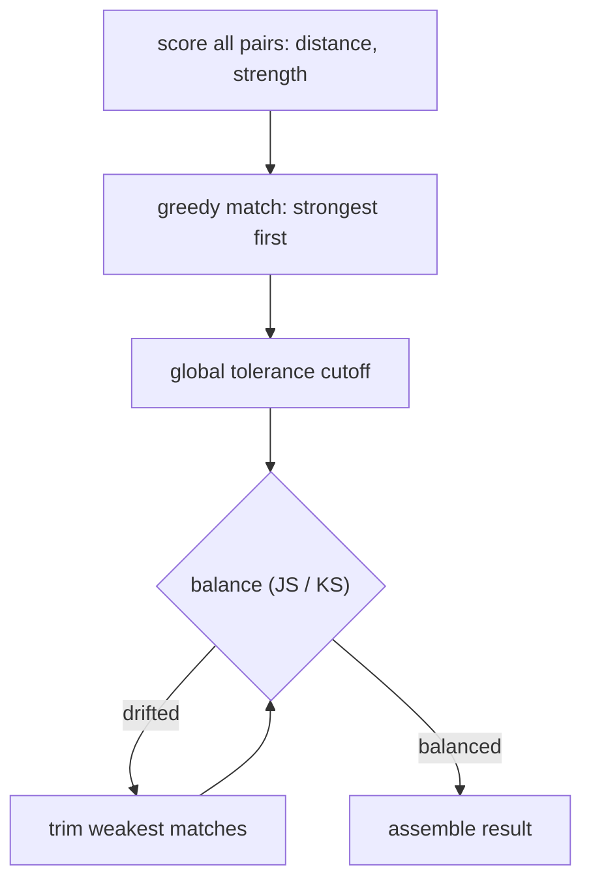

# RapidMatch (RiMatch)

**Explainable treatment/control group matching.**

RapidMatch (RiMatch, pronounced "rematch") is a Python library that builds a
**control group** from the untreated rows (`0`) of a dataset so its pre-campaign
feature distribution closely mirrors the treated rows (`1`). It is designed for
measuring the real impact of a campaign isolated from pre-existing differences
between who was targeted and who wasn't.

Fully **rule-based and explainable** end to end — no ML, no black boxes.

## Installation

> **Recommended:** install with **uv** (fast, reliable package manager).
> **Alternative:** `pip` is fully supported.

### Primary — uv

```bash
uv add rapidmatch
```

Optional extras:

```bash
uv add "rapidmatch[excel]"    # Excel support (openpyxl)
uv add "rapidmatch[progress]" # terminal progress bars (tqdm)
uv add "rapidmatch[dev]"      # development / testing
```

### Alternative — pip

```powershell
pip install rapidmatch
```

Optional extras:

```powershell
pip install "rapidmatch[excel]"    # Excel support (openpyxl)
pip install "rapidmatch[progress]" # terminal progress bars (tqdm)
pip install "rapidmatch[dev]"      # development / testing
```

### Requirements

- Python >= 3.11
- duckdb >= 1.0
- pyarrow >= 14
- numpy >= 1.26
- pandas >= 2.0 (optional, input-only convenience)
- openpyxl >= 3.1 (optional, Excel only)
- tqdm >= 4.66 (optional, progress bars only)

> **pandas is optional.** It is only used to *build* the input or to consume
> an output via `table.to_pandas()`. All matching, transformation, and scoring
> runs on DuckDB + PyArrow + NumPy, so multi-million-row inputs stay
> memory-safe and pandas never materializes an intermediate copy.

## Quick Start

```python
import pyarrow.compute as pc
from rapidmatch import ControlMatcher, MatchConfig

# Load data: file path, pandas DataFrame, or PyArrow Table
# 1 = campaign target, 0 = not targeted
config = MatchConfig(
    match_vars=["income", "age", "region"],
    treatment_col="is_target",
    id_col="id",                     # optional business id
    weights={"income": 1.5},         # optional per-variable weights
    n=1,                             # 1:1 matching (1:n supported)
    tolerance=0.2,                   # keep pairs at/above this strength quantile
    min_control_pool_size=5,
    n_bins=4,
    monitor_vars=["tenure"],         # optional: post-hoc balance checks
    js_threshold=0.10,               # JS distance flag threshold
    ks_threshold=0.05,               # KS statistic flag threshold
)

result: MatchResult = ControlMatcher(config).fit_match(df)

print(f"Matched: {result.coverage_summary['pct_matched']:.1%}")
print(f"Strength cutoff: {result.cutoff:.3f}")

# outputs are PyArrow Tables; .to_pandas() is available when you want it
statuses = result.targets["match_status"].to_pylist()
print({s: statuses.count(s) for s in dict.fromkeys(statuses)})

pairs = result.pairs
matched = pairs.filter(pc.equal(pairs["match_status"], "matched"))
print(matched.select(["target_id", "control_id", "match_strength"]).to_pylist()[:10])
```

## How It Works

Given a dataset with a binary treatment flag, RapidMatch:

1. **Ingests** any common format into DuckDB (`udl_data` view)
2. **Profiles** the data (null rates, column types, target/control counts) in one batched pass
3. **Imputes missingness** as its own group (missing only matches missing)
4. **Bins numeric match_vars** into quantiles computed from the *target* group only —
   this makes the comparison fair, since the grid is defined by those treated
5. **Stratifies** rows on binned numerics + categoricals + missingness flags
6. **Scores** every eligible target–control pair with a **global** z-score,
   weighted Euclidean distance, and `match_strength = exp(-distance)`
7. **Matches** greedily across all strata — strongest pairs first, a control row
   is never reused (sampling without replacement)
8. **Filters** by a global match-strength tolerance
9. **Validates** balance with JS distance (categorical) and KS statistic (numeric)
   on both match_vars and monitor_vars
10. **Trims** control rows responsible for drifted monitor groups (weakest matches first)
11. **Reports** coverage, balance, drift log, and the data profile

### The five matching steps, with a worked example

Every number below follows from one tiny population — **6 targeted customers,
10 untargeted** — so you can recompute any value on a napkin. Guess "small
enough to spoil the answer" and read on — the math is exactly what the
interactive explainer animates.

**The population.** Global stats (computed from the target group only, so the
grid is defined by who was treated, never by the control pool):

| Variable | Target mean | Target std | Target rows | Control rows |
|----------|-------------|------------|-------------|--------------|
| income (z)  | `0.00` | `1.00` | | |
| tenure (z)  | `0.00` | `1.00` | | |
| **stratum** | | | 1 target | 3 controls |

> Every z-score below is `(x − target_mean) / target_std`, with weights
> `income = 1.0`, `tenure = 1.5`.

**1 — Score every eligible target–control pair (global z + weighted distance).**

Each eligible pair becomes three numbers: per-variable z-differences, a
weighted Euclidean distance, and `match_strength = exp(−distance)`:

| Pair | z(income) | Δz | z(tenure) | Δz | distance | strength |
|------|-----------|----|-----------|----|----------|----------|
| T1–C1 | `1.00` / `1.00` | `0.00` | `0.50` / `0.50` | `0.00` | `0.00` | **1.000** |
| T3–C \<any\> | `1.95` / `1.00` | `0.95` | `0.75` / `0.50` | `0.25` | `1.00` | 0.368 |

Wait — why z-scores at all? Raw `$` income spans ~`$80k` while tenure spans
~`5y`; on raw units the income gap would silently *dominate* the score, and a
year of tenure couldn't compete with a thousand dollars. Z-scoring both puts
them on a common scale: `z = (x − mean) / std`, here `(80 − 70)/10 = 1.00`.
The `tenure = 1.5` weight then says: a one-`std` tenure gap is worth 1.5× a
one-`std` income gap — your call, applied everywhere.

**2 — Match greedily, strongest pairs first, across all strata.**

Every pair is scored globally, so a `0.98` pair in stratum A is taken before a
`0.60` pair in stratum B — the whole population competes, not per-silo.
A control row is **never reused** (sampling without replacement):

| Match | Target | Control | strength | action |
|-------|--------|---------|----------|--------|
| 1 | T2 | C5 | `0.98` | ✓ assign |
| 2 | T1 | C1 | `0.91` | ✓ assign |
| 3 | T3 | C2 | `0.53` | ✓ assign |
| 4 | T6 | C4 | `0.40` | ✗ below tolerance |

Once C2 is taken by T3, T4's candidate C2 is skipped — the control can only
match once in the whole run.

**3 — Filter by a global strength tolerance.**

After all strata are matched, the strength scores are collapsed, and a global
cutoff (default `tolerance = 0.8`, the 80th-percentile of strengths actually
scored) keeps only assignments at/above it — the threshold `cutoff` is applied
*across all strata at once*, keeping match strength comparable everywhere:

| assignment | strength | status |
|------------|----------|--------|
| T1–C1 | `0.98` | ✅ kept |
| T2–C5 | `0.91` | ✅ kept |
| T3–C2 | `0.49` | ❌ under cutoff |
| T6–C4 | `0.40` | ❌ under cutoff |

Weak matches aren't hidden — they're reported as `below_tolerance`, and counted
in the coverage breakdown.

**4 — Validate balance (JS for categories, KS for numeric), on match_vars
and monitor_vars.**

Balance is judged with one statistic per variable type, on *both* the variables
you matched on (`match_vars`) and the ones you only watch (`monitor_vars`):

| Statistic | Kinds | What a high value means |
|-----------|-------|--------------------------|
| **JS distance** (Jensen–Shannon) | categorical | target & matched-control distributions drifted apart |
| **KS statistic** | numeric | largest gap between the two ECDFs |

The example above is categorical (`region`): JS ≈ `0.21` vs. a naive random
pick's `0.52` — the matched set tracks the target's group mix far more closely.

**5 — Trim control rows that caused monitor drift (weakest matches first).**

If a *monitored* (unmatched-on) group is over-represented after step 4 — say
matched-tenure rows piled into the `≤ 5y` bucket — RapidMatch trims the matched
control rows responsible, weakest `match_strength` first, until the group
rebalances. **This is trim-only**: rows are removed, never re-swapped for a new
one, so coverage can shrink but the remaining pairs never change identity.



### Key Design Decisions

- **Global z-scoring** (not per-stratum), keeping `match_strength` comparable
  across strata for global greedy matching and global tolerance filtering
- **Bin edges derived from the target group only** — no data leakage from control
- **`thin_stratum` rows still get matched** but are flagged as lower-confidence
- **Every target row appears in the output**, labeled via `match_status`
- **Drift correction is trim-only** — it never swaps in replacements
- **Lazy by default** — the DuckDB pipeline executes only at named checkpoints
- **One data pass for profile + validation** — `DataReport.summary()` also returns
  the distinct treatment values, so schema validation adds no extra scan
- **Pandas-free engine** — input is ingested to DuckDB, rows are pulled into
  PyArrow, and scoring/balance use zero-copy NumPy views. No intermediate
  `to_pandas()` anywhere in the pipeline

## Public API

### `MatchConfig`

```python
cfg = MatchConfig(
    match_vars=["income", "age"],    # required
    treatment_col="is_target",       # required, binary 0/1
    id_col="id",                     # optional
    n=1,                             # matches per target row (default 1)
    tolerance=0.8,                   # global strength quantile [0, 1]
    min_control_pool_size=5,         # absolute floor per stratum
    min_control_ratio=None,          # optional ratio * target_count_in_stratum
    n_bins=4,                        # quantile bins for numeric match_vars
    weights={"income": 1.5},         # per-variable multipliers (default 1.0)
    monitor_vars=["tenure"],         # optional
    js_threshold=0.10,               # optional
    ks_threshold=0.05,               # optional
    n_workers=None,                  # optional: parallel per-stratum scoring threads
    duckdb_threads=None,             # optional: DuckDB execution threads
    progress=False,                  # optional: progress bars (tqdm extra)
)
```

> The three scaling knobs are all **opt-in** and off by default, so behavior is
> byte-for-byte identical to a serial run with no bars:
>
> - `n_workers`: score strata on a thread pool. Results are order-preserving and
>   bit-identical to serial, whatever the worker count.
> - `duckdb_threads`: hand DuckDB's execution thread count to `SET threads`.
> - `progress`: render live `tqdm` bars — Jupyter widgets inside a notebook,
>   classic stderr bars in a terminal. In a real terminal DuckDB's own query
>   progress bar is enabled too; notebooks get the widgets only (no ANSI
>   noise). With no `progress` extra, on a pipe, or out-of-band, the flag
>   silently no-ops.

### `ControlMatcher.fit_match(data)`

| Argument | Description |
|----------|-------------|
| `data` | File path (CSV/TSV/Parquet/Feather/Excel) or in-memory pandas DataFrame / PyArrow Table |
| `work_dir` | Optional temp directory for the `.duckdb` file |
| `keep_db` | If True, keep the `.duckdb` file on disk after the run |

### `MatchResult`

| Attribute | Description |
|-----------|-------------|
| `pairs` | PyArrow Table (pair-level) with `target_id`, `control_id`, `stratum`, `match_strength`, `match_rank`, `match_status`, `thin_stratum` |
| `targets` | PyArrow Table, one row per target: `match_status`, `n_matches`, `thin_stratum`, `best_strength` |
| `cutoff` | The strength quantile actually applied |
| `coverage_summary` | Counts and percent matched / no control / below tolerance |
| `report` | Module 13 artifacts: `coverage`, `balance` (`pyarrow.Table`), `drift_log` (`pyarrow.Table`), `data_profile` |

> Both `pairs` and `targets` are `pyarrow.Table` objects. Use Arrow/NumPy
> (`table.to_pylist()`, `table["col"].to_numpy(zero_copy_only=False)`,
> `pyarrow.compute`) or convert with `.to_pandas()` when convenience wins —
> converting to pandas is always your explicit choice, never a pipeline step.

**`match_status` values:**

| Status | Meaning |
|--------|---------|
| `matched` | At least one pair survived tolerance |
| `no_control_available` | Stratum had zero control rows |
| `below_tolerance` | Had assignments, all fell below cutoff |
| `unmatched` | Eligible but lost every control slot to stronger pairs |

`thin_stratum` is a separate boolean and can be True on a `matched` row.

## Supported Input Formats

All formats route through `UniversalDataLoader` (vendored from RapidSegment),
which casts numeric columns to `DOUBLE`/`float64` automatically.

| Format | Usage |
|--------|-------|
| CSV / TSV | `fit_match("data.csv")` |
| Parquet | `fit_match("data.parquet")` |
| Feather / Arrow | `fit_match("data.feather")` |
| Excel `.xlsx` / `.xls` | `fit_match("data.xlsx")` |
| pandas DataFrame | `fit_match(df)` |
| PyArrow Table | `fit_match(table)` |

## How to See the Progress Bar

Bars render only when **all three** of these hold; a one-line stderr hint tells
you which one is missing whenever `progress=True` but nothing draws:

1. **The `progress` extra is installed** (brings `tqdm`):

   ```bash
   uv add "rapidmatch[progress]"     # uv
   pip install "rapidmatch[progress]"  # pip
   ```

2. **`progress=True` in the config** — there is no default on:

   ```python
   config = MatchConfig(match_vars=[...], treatment_col="...", progress=True)
   ```

3. **You are somewhere drawable:**

   - **Terminal** — run from a real console window (Windows Terminal, cmd,
     PowerShell) where stderr is an interactive TTY. Classic bars like
     `score: 45%|████ | 45/100` appear on stderr and stay once finished.
     No bar ever appears when stderr is piped or captured (IDE "Run" panes,
     `> log.txt`, CI logs) — that is the only case bars are legitimately absent.
   - **Jupyter** — live widget bars. Install `ipywidgets` in the kernel's env
     for the fancy widgets (`uv pip install ipywidgets`); without it you still
     get a visible stderr-style bar in the cell output.

**Self-check in two seconds** — confirms rendering in your exact environment:

```bash
uv run python -c "from rapidmatch._progress import _probe; _probe()"
```

**The `uv run` vs bare `python` trap:** use `uv run demo.py`, not `python
demo.py`. The bare interpreter may be a system Python that lacks tqdm (and
possibly `rapidmatch` itself); `uv run` guarantees the project environment.

## Testing

Run tests with **uv** (recommended) or `pip`:

```bash
# uv (recommended) — install the progress extra first so bar-enabled paths are covered
uv run --extra progress pytest tests -q
uv run demo.py

# pip (alternative)
python3 -m pytest tests -q
python3 demo.py
```

Tests map 1:1 to step files (plan.md §3a):

- `tests/test_config.py` — validation errors, defaults
- `tests/test_pipeline.py` — every target covered, thin flag coexists, monitor vars
- `tests/matching/` — control never reused, n-slots
- `tests/scoring/` — strength in (0, 1], identical rows → 1.0, parallel == serial
- `tests/binning/` — bin edges derived from target only
- `tests/coverage/` — thin strata stay eligible
- `tests/data_report/` — lazy until `.summary()`, batched counts
- `tests/balance/` — identical samples → 0
- `tests/drift/` — over-represented groups trimmed
- `tests/reporting/` — coverage / balance / drift_log assembled

## Project Structure

```
rapidmatch/
├── __init__.py         # public exports: ControlMatcher, MatchConfig, MatchResult
├── config.py           # Module 3: MatchConfig frozen dataclass + validation
├── pipeline.py         # Module orchestration (Modules 1-13)
├── _sql.py             # DuckDB identifier quoting
├── _progress.py        # opt-in terminal bars (tqdm) + no-op fallback
├── ingestion/          # Module 1: UniversalDataLoader → DuckDB + MatchSession
├── data_report/        # Module 2: lazy batched profiling
├── missingness/        # Module 4: sentinel imputation + missing flags
├── binning/            # Module 5: quantile bins + composite stratum key
├── coverage/           # Module 6: no_control / thin / eligible
├── scoring/            # Module 7: global z-score + weighted Euclidean distance
│   └── score_strata.py # order-preserving parallel per-stratum scoring (opt-in)
├── matching/           # Module 8: global greedy, without replacement
├── tolerance/          # Module 9: global strength percentile cutoff
├── output/             # Module 10: DuckDB-backed MatchResult roll-up
├── balance/            # Module 11: JS / KS balance validation (Arrow-backed)
├── drift/              # Module 12: trim-only drift correction (Arrow-backed)
├── reporting/          # Module 13: coverage / balance / drift_log / profile
tests/                  # 1:1 test coverage for each step
```

## Design Documentation

- `plan.md` — the locked product design (source of truth, all 14 modules)
- `codegraph.md` — the running-code map for LLMs and contributors

## License

Copyright © RapidMatch contributors

Licensed under the **Apache License, Version 2.0** (the "License"); you may not
use this project except in compliance with the License. You may obtain a copy of
the License at:

    http://www.apache.org/licenses/LICENSE-2.0

Unless required by applicable law or agreed to in writing, software distributed
under the License is distributed on an "AS IS" BASIS, WITHOUT WARRANTIES OR
CONDITIONS OF ANY KIND, either express or implied. See the License for the
specific language governing permissions and limitations under the License.