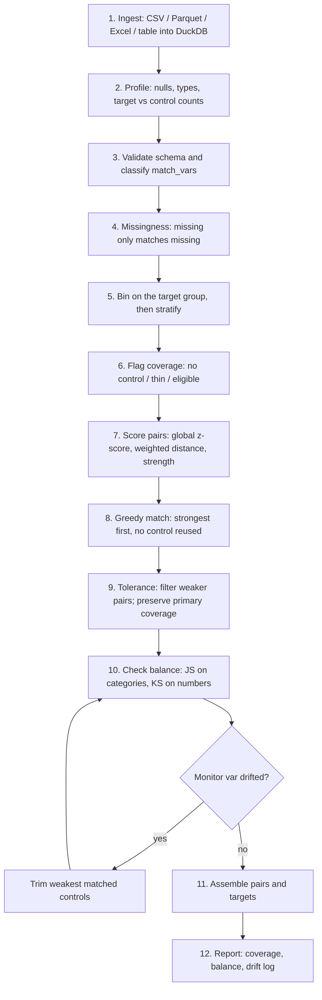
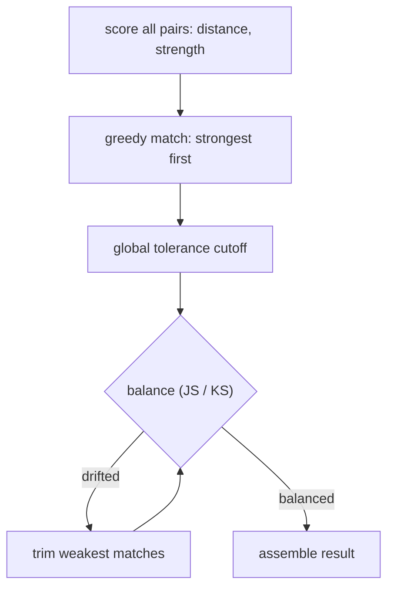

# RapidMatch (RiMatch)

**Explainable treatment/control matching and representative downsampling.**

RapidMatch (RiMatch, pronounced "rematch") is a Python library that builds a
**control group** from the untreated rows (`0`) of a dataset so its pre-campaign
feature distribution closely mirrors the treated rows (`1`). It is designed for
measuring the real impact of a campaign isolated from pre-existing differences
between who was targeted and who wasn't.

For ML datasets, `random_downsample` selects an exact user-requested number of
rows, optionally preserving the observed Y-class proportions, and verifies
feature similarity against the full input population.

Fully **rule-based and explainable** end to end — no ML, no black boxes.


## Installation

> **Recommended:** install with **uv** (fast, reliable package manager).
> **Alternative:** `pip` is fully supported.

### Primary — uv

```bash
uv add rapidmatch
```

Optional extras:

```bash
uv add "rapidmatch[excel]"    # Excel support (openpyxl)
uv add "rapidmatch[progress]" # terminal progress bars (tqdm)
uv add "rapidmatch[dev]"      # development / testing
uv add "rapidmatch[notebook]"  # notebook representation plots (matplotlib)
```

### Alternative — pip

```powershell
pip install rapidmatch
```

Optional extras:

```powershell
pip install "rapidmatch[excel]"    # Excel support (openpyxl)
pip install "rapidmatch[progress]" # terminal progress bars (tqdm)
pip install "rapidmatch[dev]"      # development / testing
pip install "rapidmatch[notebook]"  # notebook representation plots (matplotlib)
```

### Requirements

- Python >= 3.11
- duckdb >= 1.0
- pyarrow >= 14
- numpy >= 1.26
- pandas >= 2.0 (optional, input-only convenience)
- openpyxl >= 3.1 (optional, Excel only)
- tqdm >= 4.66 (optional, progress bars only)

> **pandas is optional.** It is only used to *build* the input or to consume
> an output via `table.to_pandas()`. All matching, transformation, and scoring
> runs on DuckDB + PyArrow + NumPy without intermediate pandas copies. Matching
> memory depends on candidate-pair volume; use the capacity preflight and candidate
> cap when needed. Downsampling keeps full-population operations inside DuckDB.

## Quick Start

```python
import pyarrow.compute as pc
from rapidmatch import ControlMatcher, MatchConfig

# Load data: file path, pandas DataFrame, or PyArrow Table
# 1 = campaign target, 0 = not targeted
config = MatchConfig(
    match_vars=["income", "age", "region"],
    treatment_col="is_target",
    id_col="id",                     # optional business id
    weights={"income": 1.5},         # optional per-variable weights
    n=1,                             # 1:1 matching (1:n supported)
    tolerance=0.2,                   # filter weaker secondary assignments
    min_control_pool_size=5,
    n_bins=4,
    monitor_vars=["tenure"],         # optional: post-hoc balance checks
    js_threshold=0.10,               # flag if category mixes differ too much
    ks_threshold=0.05,               # flag if numeric lineups drift too far
)

result: MatchResult = ControlMatcher(config).fit_match(df)

print(f"Matched: {result.coverage_summary['pct_matched']:.1%}")
print(f"Strength cutoff: {result.cutoff:.3f}")

# outputs are PyArrow Tables; .to_pandas() is available when you want it
statuses = result.targets["match_status"].to_pylist()
print({s: statuses.count(s) for s in dict.fromkeys(statuses)})

pairs = result.pairs
matched = pairs.filter(pc.equal(pairs["match_status"], "matched"))
print(matched.select(["target_id", "control_id", "match_strength"]).to_pylist()[:10])

# The control group = unique control_id values that survived matching.
# control_id is your id_col (or the internal _rm_id if you omitted id_col).
control_ids = set(matched["control_id"].to_pylist())
control_rows = df[df["id"].isin(control_ids)]
```

`result.pairs` is one row per pair, not the original table. Join those ids
back onto your input to get the actual control rows.

| column | meaning |
|--------|---------|
| `target_id` / `control_id` | Your `id_col` if you set one; otherwise RapidMatch's internal `_rm_id` |
| `target_rm_id` / `control_rm_id` | Always the internal 1-based row number (`ROW_NUMBER()` at ingest). Use this only if you kept the DuckDB file (`keep_db=True`) and join on `_rm_id`. |


## Exact-size ML downsampling

```python
from rapidmatch import random_downsample

result = random_downsample(
    data="training_data.parquet",  # also accepts a pandas DataFrame or Arrow Table
    sample_size=25_000,             # exact row count, without replacement
    label_col="Y",                 # optional; class proportions inferred from input
    stratify_vars=["region", "age", "income"],
    check_vars=["tenure", "spend"],
    n_bins=4,
    random_state=42,
    ks_threshold=0.05,
    js_threshold=0.10,
    check_by_label=True,            # also require feature balance within each class
)

sample = result.sample              # original ingested columns, PyArrow Table
print(result.report.summary["balance_status"])  # pass / fail / not_evaluated
print(result.report.classes.to_pylist())
print(result.report.balance.to_pylist())
print(result.report.recommendations)
```

No treatment column or artificial 1/0 split is needed. `label_col` names the
classification outcome, not a campaign-treatment flag. A 90:10 population sampled
to 10,000 rows gets 9,000 and 1,000 rows respectively. Integer class quotas are
allocated first by largest remainder, then allocated across feature strata within
each class. Random selection fills those quotas without reusing a source row.
The overall Y ratio is **not** forced into every feature stratum.

Numeric feature bins come from the **whole population**. Classification labels
are categorical even if stored as numbers. Missing labels form an explicit group;
the report uses JSON-encoded class values (for example `[0.0]` or `[null]`). A
continuous regression outcome can instead be a numeric grouping/check variable.
Missing/nonfinite numeric grouping values form an explicit group; finite values
are used for numeric distribution statistics, with missing rates reported separately.

| Argument | Default | Meaning |
|---|---|---|
| `sample_size` | required | Positive integer at most the population count; requesting the whole population returns all rows |
| `label_col` | `None` | Optional categorical outcome whose observed proportions are preserved, up to integer rounding |
| `stratify_vars` | `()` | Feature groups receiving proportional quotas; selected numeric variables are binned |
| `check_vars` | `()` | Additional features to check; grouping features are always checked |
| `n_bins` | `4` | Whole-population numeric quantile bins, at least two |
| `random_state` | `None` | Nonnegative integer seed below `2**63`; an omitted seed is generated and recorded in the summary |
| `ks_threshold` / `js_threshold` | `0.05` / `0.10` | Numeric KS and categorical natural-log JS divergence thresholds |
| `check_by_label` | `False` | Add required within-class feature checks; requires `label_col` |
| `duckdb_threads` | `None` | DuckDB execution threads; identity is established serially before parallel operations |
| `max_report_rows` | `1000` | Maximum rows in each class/stratum/balance detail table; summary totals and acceptance include all rows |
| `work_dir` / `keep_db` | `None` / `False` | Temporary DuckDB location and optional retention, as in matching |

With no label or grouping features, selection is simple random sampling. With a
label only, selection is random within each allocated class. A fixed seed gives
the same selected rows for the same ingested data/order and library versions,
independent of `duckdb_threads`. Duplicate-valued input records are distinct source
rows; `result.row_ids` exposes their internal identities separately from the sample.
Input columns beginning with `_rs_` are reserved and rejected.

**Representation is checked, not assumed.** A feature passes at KS ≤ its numeric
threshold or JS divergence ≤ its categorical threshold. JS uses natural logarithms,
not the square-root distance (range 0 to ln(2)). These tolerances are not p-values.
Any failed required feature yields `balance_status="fail"`. If no checks were
requested or a required comparison is unavailable, the outcome is `not_evaluated`
unless another check failed. Label-count invariants are checked separately from
feature acceptance. Passing applies to the declared features/scopes, not every
unmeasured joint relationship.

The sample always retains its requested size and rounded class budgets, even when
balance fails. Inspect failed features and recommendations; settings and thresholds
are never silently changed. Very small samples can omit rare classes or feature
groups. The report includes omitted population shares and detail-truncation flags.
Full-population grouping, selection, and exact KS/JS stay in DuckDB; only the
selected rows and bounded reports are pulled into Python. Output memory still
depends on the selected row count and width.

Runnable example: `python3 demo_downsample.py`.

### End-to-end example: a memory-constrained ML training dataset

**Use case:** you have a large training dataset and want a smaller dataset that fits
your model's memory budget. Its classification label `Y` is imbalanced (90% class 0,
10% class 1). You want the requested row count, that same overall label mix, and
feature distributions close to the full training population—not just matching
label counts.

Use RapidMatch on the **training partition** after establishing your train/
validation/test split. The supplied training partition is the reference population
for class proportions, bins, and balance checks. Evaluate the model on your held-out
data. For real datasets, pass a file path so the library can operate through DuckDB
instead of first constructing a full pandas DataFrame.

The complete runnable walkthrough is [`demo_ml_downsample.py`](demo_ml_downsample.py):

```bash
# Run in the project environment after installation.
python demo_ml_downsample.py
# Or choose the output directory:
python demo_ml_downsample.py /path/to/demo-output
```

It generates 100,000 synthetic training rows, writes a Parquet input, evaluates an
initial 1,000-row candidate, demonstrates an explicit larger request when needed,
and exports the accepted training sample plus a JSON report. You can also follow
the steps below sequentially in a notebook.

For full-scale public binary-classification datasets, use these notebooks:

| Notebook | Predictors | Training population | Selected rows |
|---|---:|---:|---:|
| [`ML_downsample_HIGGS.ipynb`](ML_downsample_HIGGS.ipynb) | 28 | 10,500,000 | 100,000 |
| [`ML_downsample_SUSY.ipynb`](ML_downsample_SUSY.ipynb) | 18 | 4,500,000 | 100,000 |

Both reserve the published final 500,000 records for testing, preserve observed
class proportions, and check every predictor overall and within each class.
Install `.[notebook]` in your notebook kernel and run the cells in order. The first
run downloads the complete UCI dataset (HIGGS: about 2.6 GB; SUSY: about 880 MB),
so run them sequentially and allow working space for Parquet and DuckDB files.
Shared preparation/plotting helpers live in `notebook_downsample.py`.

Downloads, prepared partitions, and per-run sample/report/plot exports are cached
under `.cache/ml_downsample/{higgs,susy}/`. Set `RAPIDMATCH_NOTEBOOK_CACHE` to use
another disk. Each export includes source fingerprints, settings, versions, and
acceptance status; failed balance checks retain an explicitly named candidate
with exactly 100,000 rows rather than silently changing the request.

#### 1. Prepare the training population

This small synthetic population makes the example self-contained. For your actual
ML use case, start with your existing training file and skip generation.

```python
import numpy as np
import pyarrow as pa
import pyarrow.parquet as pq

rng = np.random.default_rng(42)
n = 100_000
y = np.array([0] * 90_000 + [1] * 10_000)
rng.shuffle(y)

population = pa.table({
    "customer_id": np.arange(n),
    "Y": y,
    "region": rng.choice(["north", "south", "west"], n, p=[0.5, 0.3, 0.2]),
    "age": np.clip(rng.normal(40 + 5 * y, 12, n), 18, 80),
    "income": rng.lognormal(10.5 + 0.2 * y, 0.45, n),
    "tenure": rng.integers(0, 15, n),
    "spend": rng.gamma(2.0 + y, 300, n),
})
input_path = "training_population.parquet"
pq.write_table(population, input_path)
del population
```

#### 2. Request a sample and choose feature roles

```python
from rapidmatch import random_downsample

settings = dict(
    sample_size=1_000,
    label_col="Y",
    stratify_vars=["region", "age", "income"],
    check_vars=["tenure", "spend"],
    n_bins=4,
    random_state=42,
    ks_threshold=0.05,
    js_threshold=0.10,
    check_by_label=True,
)
result = random_downsample(input_path, **settings)
```

- **`sample_size`:** the exact number of rows you can afford to train on. Here the
  class budgets are 900 and 100; a subsequent request for 10,000 rows gets 9,000 and
  1,000. RapidMatch calculates these counts from the input.
- **`label_col`:** the ML label to preserve. No manual class ratio is required.
- **`stratify_vars`:** a manageable set of important features whose groups receive
  proportional slots. Numeric features get quantile bins; categories remain exact.
  Putting all 100+ features here can fragment the data into tiny groups.
- **`check_vars`:** additional features to verify without creating more strata.
  Include the remaining features whose representation matters. Grouping features
  are already checked, and unrelated identifiers should not be grouping features.
- **`check_by_label=True`:** require similarity both overall and within each Y class.
  This catches differences that can cancel out in the overall distribution.

Every original ingested column is retained in `result.sample`, including columns
you did not select for grouping or checking. Only the declared feature-check scope
is assessed for similarity.

#### 3. Inspect the size, class allocation, and acceptance outcome

```python
summary = result.report.summary
print("Requested / returned:", summary["requested_rows"], summary["sampled_rows"])
print("Exact count checks passed:", summary["count_invariants_passed"])
print("Class budgets passed:", summary["class_budgets_passed"])
print("Feature acceptance:", summary["balance_status"])
print("Failed / unavailable checks:",
      summary["checks_failed"], summary["checks_not_evaluated"])
print(result.report.classes.to_pylist())
```

The class table contains `population_share`, `ideal_quota`, `allocated_rows`,
`sampled_rows`, `sample_share`, and `rounding_deviation`. Compare **overall** Y
proportions here; feature strata need not each have the same Y ratio.

| `balance_status` | Interpretation |
|---|---|
| `pass` | Every required feature comparison in the declared scope was available and within its threshold |
| `fail` | At least one required comparison exceeded its threshold; exact row count and class budgets still hold |
| `not_evaluated` | No feature comparisons were requested, or a required comparison was unavailable and none failed |

`class_budgets_passed=True` alone does not establish representative features. For
example, a 1,000-row sample can have exactly 900/100 labels but too few minority
rows to track the minority's spending distribution closely.

#### 4. Find which feature distributions differ

```python
import pyarrow.compute as pc

balance = result.report.balance
issues = balance.filter(
    pc.and_(balance["required"], pc.not_equal(balance["status"], "pass"))
)
print(issues.select([
    "variable", "scope", "label", "kind", "statistic", "threshold",
    "n_population", "n_sample", "status",
]).to_pylist())

print("Omitted feature groups:", summary["omitted_strata"])
print("Population share in omitted groups:", summary["omitted_stratum_population_share"])
print("Detail tables truncated:", summary["classes_truncated"],
      summary["strata_truncated"], summary["balance_truncated"])
```

Read a feature-check row as follows:

- `scope="overall"` compares the full training population with the whole sample.
- `scope="within_label"` compares a class in the original population with its
  sampled rows; `label` identifies that class.
- `kind="ks"` measures the largest cumulative-distribution gap for a numeric
  feature. `kind="js"` measures categorical share divergence.
- `statistic <= threshold` passes. For example, a KS of `0.08` fails a `0.05`
  threshold; it is not an 8% p-value.
- `not_evaluated` can mean no finite numeric observations or no sampled rows in
  that class. Missing rates and valid-observation counts are also available.

Detail tables are bounded by `max_report_rows`. The aggregate assessment includes
**all** checks, even when some detail rows are omitted. Increase this limit if you
need more detail and have room to display it. `report.strata` shows the allocated
and selected rows and conditional proportions behind feature grouping.

#### 5. Read recommendations and decide what to change

```python
for recommendation in result.report.recommendations:
    print("Setting:", recommendation["setting"])
    print("Suggested value:", recommendation["proposed_value"])
    print("Why:", recommendation["reason"])
    print("Evidence:", recommendation["evidence"])
    print("Trade-off:", recommendation["tradeoff"])
```

`proposed_value=None` means review that setting using the evidence; it does **not**
mean assign Python `None` to the parameter. Some choices require your domain
knowledge or memory budget. An empty recommendation list is valid.

| Evidence | How to interpret it |
|---|---|
| `measured_allocation` | Actual class/stratum quotas exposed an omission; a larger sample may help, but a new size has not been tested automatically |
| `measured_balance` | Actual feature checks failed or were unavailable; inspect those rows before deciding how to change grouping or sample size |
| `untested_suggestion` | A proposed configuration, such as fewer bins, still needs a new run and balance verification |
| `measured_preflight` | Used by **control matching's** `assess(...)`: alternative bins were counted, giving measured capacity/work, not verified feature balance |

Typical actions:

| Observed issue | Possible user-selected action | Trade-off |
|---|---|---|
| A rare Y class receives zero rows | Request a larger `sample_size` if the budget allows | More output/model memory; changing feature bins cannot change that class's outer quota |
| Many feature groups receive no rows | Try fewer bins or a smaller grouping set | Less fragmentation, but weaker control of feature detail; rerun checks |
| A checked feature fails | Consider including it in `stratify_vars`, revisiting grouping, or requesting more rows | Adding a feature can create sparse groups; improvement is not guaranteed |
| Within-class checks fail while overall checks pass | Inspect that class's features and sample count | Overall similarity alone is insufficient for the declared within-class requirement |

Recommendations are evidence and suggestions, not automatic changes. A failed
candidate does not prove that no representative sample of that size exists. The
library does not silently retry, change your requested size, alter class budgets,
or relax thresholds to manufacture a pass.

#### 6. Explicitly choose and evaluate a revised request

For this walkthrough, assume you inspect the initial result and decide the memory
budget allows **10,000 rows** if the 1,000-row candidate does not pass. This is an
explicit caller decision; the library still returns exactly the size passed on
each call.

```python
if result.report.summary["balance_status"] != "pass":
    revised_settings = {**settings, "sample_size": 10_000}
    revised = random_downsample(input_path, **revised_settings)

    for name, candidate in [("initial", result), ("revised", revised)]:
        s = candidate.report.summary
        print(name, s["sampled_rows"], s["balance_status"], s["checks_failed"])

    result = revised
```

In the verified seeded walkthrough (using the versions recorded in
[`docs/plan.md`](docs/plan.md)), the results were:

| Request | Returned rows | Class 0 / class 1 | Required feature checks | Omitted feature groups |
|---|---:|---:|---|---:|
| Initial | 1,000 | 900 / 100 | Failed 3 within-minority-class checks | 2 |
| Explicit larger request | 10,000 | 9,000 / 1,000 | All passed | 0 |

The initial minority-class KS values were approximately `0.0845` for income,
`0.0630` for spend, and `0.0745` for tenure, each above `0.05`. This illustrates why
correct Y proportions alone are insufficient. Both calls returned their exact
requested sizes; the second used the explicitly increased budget and reduced the
training population's row count tenfold. Your dataset can produce different
outcomes, and reproducibility across library versions is not guaranteed.

You can similarly test a different `n_bins` or grouping set while keeping
`sample_size` fixed. Reinspect the feature checks after every change. A larger
sample or different grouping is not itself proof of acceptable balance.

#### 7. Export the report and the accepted training sample

```python
import json
from pathlib import Path

Path("training_sample.report.json").write_text(
    json.dumps(result.report.to_dict(), indent=2), encoding="utf-8"
)

if result.report.summary["balance_status"] == "pass":
    pq.write_table(result.sample, "training_sample.parquet")

    # Supply these to your model-training workflow.
    X_train = result.sample.drop(["customer_id", "Y"])
    y_train = result.sample["Y"]
    print("Training shape:", X_train.num_rows, X_train.num_columns)
else:
    print("Review the saved report before accepting this sample for training.")
```

The example exports training data only after the declared checks pass, but a failed
candidate remains accessible through `result.sample` for inspection. The JSON
report records settings, seed, class/stratum allocations, acceptance outcomes, and
recommendations. The Arrow sample can be converted with `.to_pandas()` if your
training workflow needs pandas; only the chosen sample is converted.

## Matching capacity and high-dimensional grouping

```python
from rapidmatch import ControlMatcher, MatchConfig

matcher = ControlMatcher(MatchConfig(
    match_vars=["region", "age", "income", "tenure"],
    stratify_vars=["region", "age"],  # fewer hard constraints
    treatment_col="is_target",
    n_bins=4,
))
capacity = matcher.assess("campaign.parquet", n_bins_candidates=[4, 3, 2])
print(capacity.summary)
print(capacity.trials.to_pylist())
print(capacity.recommendations)

result = matcher.fit_match("campaign.parquet")
print(result.report.capacity.summary)
```

All numeric `match_vars` still contribute to distance. Categorical matching
variables must remain in `stratify_vars`, and numeric missingness flags remain hard
constraints even for score-only features. Omitting `stratify_vars` preserves the
existing grouping. This lets users retain many numeric similarity features without
binning every one of them into the composite stratum.

Before scoring, a run reports local capacity shortfalls separately from thin pools.
A stratum with 100 targets and 50 controls cannot deliver 1:1, even with abundant
controls elsewhere. For 1:1 the ceiling is `sum(min(targets, controls))` over strata.
For 1:n, reports distinguish available assignments, targets that could receive one
control, and targets that could receive all n controls. These are **upper bounds**,
not promises of final coverage after candidate pruning or drift trimming.

`assess` ingests once and performs no distance scoring or matching. Its optional
bin trials measure capacity and pairwise work without mutating the matcher/config.
Measured recommendations are distinguished from untested suggestions. Fewer bins
can increase candidate-pair volume; lowering the thin-pool floor cannot create
matches, since thin strata already participate. No bin setting fixes a global
shortage of unique controls. Capacity detail defaults to 1,000 strata, configurable
with `max_report_strata` on `assess`; summary counts remain complete.

## How It Works

Given a dataset with a binary treatment flag, RapidMatch:

1. **Ingests** any common format into DuckDB (`udl_data` view)
2. **Profiles** the data (null rates, column types, target/control counts) in one batched pass
3. **Imputes missingness** as its own group (missing only matches missing)
4. **Bins numeric match_vars** into quantiles computed from the *target* group only —
   this makes the comparison fair, since the grid is defined by those treated
5. **Stratifies** rows on binned numerics + categoricals + missingness flags
6. **Scores** every eligible target–control pair with a **global** z-score,
   weighted Euclidean distance, and `match_strength = exp(-distance)`
7. **Matches** greedily across all strata — strongest pairs first, a control row
   is never reused (sampling without replacement)
8. **Filters** weaker assignments by a global match-strength tolerance while
   preserving each target's strongest unique assignment
9. **Checks balance:** are the two groups still similar on categories (JS) and
   numbers (KS), for both match_vars and monitor_vars?
10. **Trims** control rows responsible for drifted monitor groups (weakest matches first)
11. **Reports** coverage, balance, drift log, and the data profile


```mermaid
flowchart TD
    A["1. Ingest: CSV / Parquet / Excel / table into DuckDB"]
    B["2. Profile: nulls, types, target vs control counts"]
    C["3. Validate schema and classify match_vars"]
    D["4. Missingness: missing only matches missing"]
    E["5. Bin on the target group, then stratify"]
    F["6. Flag coverage: no control / thin / eligible"]
    G["7. Score pairs: global z-score, weighted distance, strength"]
    H["8. Greedy match: strongest first, no control reused"]
    I["9. Tolerance: filter weaker pairs; preserve primary coverage"]
    J["10. Check balance: JS on categories, KS on numbers"]
    K{"Monitor var drifted?"}
    L["Trim weakest matched controls"]
    M["11. Assemble pairs and targets"]
    N["12. Report: coverage, balance, drift log"]

    A --> B --> C --> D --> E --> F --> G --> H --> I --> J --> K
    K -- yes --> L --> J
    K -- no --> M --> N
```

Teal-style prep is steps 1–6. Matching and checking are steps 7–12. Thin strata still go through scoring; they are flagged, not dropped.

### The five matching steps, with a worked example

Every number below follows from one tiny population — **6 targeted customers,
10 untargeted** — so you can recompute any value on a napkin. Guess "small
enough to spoil the answer" and read on — the math is exactly what the
interactive explainer animates.

**The population.** Global stats (computed from the target group only, so the
grid is defined by who was treated, never by the control pool):

| Variable | Target mean | Target std | Target rows | Control rows |
|----------|-------------|------------|-------------|--------------|
| income (z)  | `0.00` | `1.00` | | |
| tenure (z)  | `0.00` | `1.00` | | |
| **stratum** | | | 1 target | 3 controls |

> Every z-score below is `(x − target_mean) / target_std`, with weights
> `income = 1.0`, `tenure = 1.5`.

**1 — Score every eligible target–control pair (global z + weighted distance).**

Each eligible pair becomes three numbers: per-variable z-differences, a
weighted Euclidean distance, and `match_strength = exp(−distance)`:

| Pair | z(income) | Δz | z(tenure) | Δz | distance | strength |
|------|-----------|----|-----------|----|----------|----------|
| T1–C1 | `1.00` / `1.00` | `0.00` | `0.50` / `0.50` | `0.00` | `0.00` | **1.000** |
| T3–C \<any\> | `1.95` / `1.00` | `0.95` | `0.75` / `0.50` | `0.25` | `1.00` | 0.368 |

Wait — why z-scores at all? Raw `$` income spans ~`$80k` while tenure spans
~`5y`; on raw units the income gap would silently *dominate* the score, and a
year of tenure couldn't compete with a thousand dollars. Z-scoring both puts
them on a common scale: `z = (x − mean) / std`, here `(80 − 70)/10 = 1.00`.
The `tenure = 1.5` weight then says: a one-`std` tenure gap is worth 1.5× a
one-`std` income gap — your call, applied everywhere.

**How z-scores are calculated (several numeric vars).** This happens
**once**, before any pair is scored, and only on the **target** group
(`treatment = 1`). It is **not** parallel — `n_workers` only parallelizes
later, when each stratum's pairs are scored. For every numeric `match_var`
independently:

1. `mean` = average of that column among all target rows
2. `std`  = how spread out that column is among all target rows
   (if a column is constant, `std` is treated as `1` so we never divide by zero)
3. Every target **and** control row is then rewritten as
   `z = (value − mean) / std` using **those same target mean/std**

Example with two numeric vars. Suppose the target group has:

| | income | tenure |
|--|--------|--------|
| target mean | `70,000` | `5.0` |
| target std  | `10,000` | `2.0` |
| weights     | `1.0` | `1.5` |

A row with income `80,000` and tenure `6` becomes:

- `z_income = (80000 − 70000) / 10000 = 1.00`, then × weight `1.0` → `1.00`
- `z_tenure = (6 − 5) / 2 = 0.50`, then × weight `1.5` → `0.75`

Do the same for the other person in the pair. Distance is ordinary Euclidean
on those weighted z's. With two variables:

`distance = sqrt( (z_income_T − z_income_C)² + (z_tenure_T − z_tenure_C)² )`

Add more numeric `match_vars` the same way: one extra `(Δz × weight)²` inside
the square root. Categorical `match_vars` do **not** enter this formula —
they already put the two people in the same stratum (or not). If a stratum
is categorical-only, every pair in it has distance `0` and strength `1`.

**Scoring formulas (n numeric `match_vars`).** Moments `μ_k`, `σ_k` are
computed **once** from the whole target group (`treatment = 1`). A constant
column uses `σ_k = 1` so we never divide by zero. Weight `w_k` defaults to
`1`. For feature `k = 1 … n`:

```
z_k        = (x_k − μ_k) / σ_k
a_k        = w_k · z_k                         (target row)
b_k        = w_k · z_k                         (control row)

d(a, b)    = sqrt( Σ_{k=1}^{n} (a_k − b_k)² )  (weighted Euclidean)

strength   = exp(−d(a, b))                     always in (0, 1]
```

`d = 0` (identical after z-score + weights) → `strength = 1`. Larger `d`
slides toward `0`, never negative, never above `1`. The engine evaluates
`d` as `||a||² + ||b||² − 2 a·b` (same Euclidean distance, no 3D
difference cube). Pair ranking is unchanged.

Same mean/std everywhere is the point: a `z = 1` on income means the same
thing in every stratum, so match strengths can be sorted and cut globally.

**Why not stop at Euclidean distance?** We *do* use ordinary (weighted)
Euclidean distance — that is the gap. `match_strength = exp(−distance)` does
not change who is closer than whom. It only **relabels** that gap as a
familiar 0-to-1 closeness:

- Distance `0` (identical after z-score + weights) → strength `1.0` (“perfect”)
- Distance `1` → strength `≈ 0.37`
- Bigger distance → strength slides toward `0`, never negative, never above `1`

Greedy matching and the tolerance cutoff both need one number they can sort
and threshold *across every stratum*. Raw distance is “smaller is better” and
has no ceiling (a pair can be arbitrarily far). Strength flips that to
“bigger is better” and puts every pair on the same 0–1 ruler, so a `0.91` in
stratum A is comparable to a `0.91` in stratum B. The ranking of pairs is
exactly the ranking of distances reversed — no extra model, no extra
information.

**2 — Match greedily, strongest pairs first, across all strata.**

Every pair is scored globally, so a `0.98` pair in stratum A is taken before a
`0.60` pair in stratum B — the whole population competes, not per-silo.
A control row is **never reused** (sampling without replacement):

| Match | Target | Control | strength | action |
|-------|--------|---------|----------|--------|
| 1 | T2 | C5 | `0.98` | ✓ assign |
| 2 | T1 | C1 | `0.91` | ✓ assign |
| 3 | T3 | C2 | `0.53` | ✓ assign |
| 4 | T6 | C4 | `0.40` | ✗ below tolerance |

Once C2 is taken by T3, T4's candidate C2 is skipped — the control can only
match once in the whole run.

**3 — Filter weaker assignments by a global strength tolerance.**

After all strata are matched, the strength scores are collapsed, and a global
cutoff (default `tolerance = 0.8`, the 80th-percentile of strengths actually
scored) keeps assignments at/above it — the threshold `cutoff` is applied
*across all strata at once*, keeping match strength comparable everywhere.
Each target's strongest unique assignment is retained even when it falls below
the cutoff, so tolerance cannot silently remove a target from the full-target
analysis:

| assignment | strength | status |
|------------|----------|--------|
| T1–C1 | `0.98` | ✅ kept |
| T2–C5 | `0.91` | ✅ kept |
| T3–C2 | `0.49` | ⚠️ kept as low quality |
| T6–C4 | `0.40` | ⚠️ kept as low quality |

Weak retained matches aren't hidden — they're reported with
`quality_status = "low_quality"` and counted in the coverage breakdown.

**4 — Check that the matched control still looks like the target.**

After matching, RapidMatch asks a simple question for every variable you
cared about (`match_vars`) and every variable you only watch (`monitor_vars`):
*if I compare the two groups, how different are they?* One number per column.

| Kind of column | The number | `0` means | A high value means |
|----------------|------------|-----------|--------------------|
| Categories (`occupation`…) | **JS** | the two mixes are the same | the recipes drifted apart |
| Numbers (`age` / `income`…) | **KS** | the two groups climb at the same pace | they pull apart somewhere |

---

#### Categories — JS Distance (worked example)

JS Distance tells you **how different two categorical distributions are**.

**Example data** — preferred payment method in two groups of 100 people each:

| Payment Method | Group A (P) | Group B (Q) |
|----------------|-------------|-------------|
| Credit Card    | 0.50        | 0.20        |
| UPI            | 0.30        | 0.50        |
| Cash           | 0.20        | 0.30        |

**Step 1.** Build the mixture distribution M = (P + Q) / 2:

| Payment Method | M        |
|----------------|----------|
| Credit Card    | 0.35     |
| UPI            | 0.40     |
| Cash           | 0.25     |

**Step 2.** Compute KL(P ‖ M) and KL(Q ‖ M) (base-2 log):

- KL(P ‖ M) ≈ 0.0684
- KL(Q ‖ M) ≈ 0.0784

**Step 3.** JS Divergence = ½ × KL(P‖M) + ½ × KL(Q‖M) ≈ **0.0734**

**Step 4.** JS Distance (commonly reported) = √(JS Divergence) ≈ **0.271**

**Intuition:** Imagine two bowls of marbles, one colour per category.
JS measures how different the two bowls look by comparing each to their
average mix. `0` = identical mix; larger values = more different.
In the toy run, matched `occupation` lands at JS ≈ `0.18` versus `0.41`
for a random pick of controls — the matched set tracks the target far more closely.

---

#### Numbers — KS Statistic (worked example)

KS measures the **single biggest gap** between the two empirical cumulative
distribution functions (ECDFs).

**Example data** — 10 people with income and a binary target:

| Person | Income | Target |
|--------|--------|--------|
| A      | 20     | 0      |
| B      | 30     | 0      |
| C      | 40     | 1      |
| D      | 50     | 0      |
| E      | 60     | 1      |
| F      | 70     | 1      |
| G      | 80     | 0      |
| H      | 90     | 1      |
| I      | 100    | 1      |
| J      | 110    | 0      |

**Step 1.** Split by target:

- Yes (Target=1): 40, 60, 70, 90, 100  (5 people)
- No  (Target=0): 20, 30, 50, 80, 110  (5 people)

**Step 2.** At every income value compute the cumulative % of each group
that is ≤ that value, then take the absolute difference:

| Income | % Yes ≤ | % No ≤ | |Difference| |
|--------|---------|--------|-------------|
| 20     | 0 %     | 20 %   | 20 %        |
| 30     | 0 %     | 40 %   | **40 %**    |
| 40     | 20 %    | 40 %   | 20 %        |
| 50     | 20 %    | 60 %   | **40 %**    |
| 60     | 40 %    | 60 %   | 20 %        |
| 70     | 60 %    | 60 %   | 0 %         |
| 80     | 60 %    | 80 %   | 20 %        |
| 90     | 80 %    | 80 %   | 0 %         |
| 100    | 100 %   | 80 %   | 20 %        |
| 110    | 100 %   | 100 %  | 0 %         |

**Step 3.** The largest gap is **40 %** → **KS = 0.40**

**Visual intuition:**

```
% of people
100% |                          /----- Yes
     |                       /
 80% |                    /          /----- No
     |                 /          /
 60% |              /          /
     |           /          /
 40% |        /          /
     |     /          /
 20% |  /          /
  0% |/__________/________________ income
     20  30  40  50  60  70  80  90 100 110
```

The two climbing lines are farthest apart (vertically) at incomes 30 and 50.
That tallest vertical distance is the KS statistic.

`0` = the groups rise together; small = close enough; large = one group is
packed low (or high) while the other isn’t.
In the library’s Verify screen you typically see something like `0.09` after
matching versus `0.47` before — the lineups almost climb in lockstep once
matched.

**5 — Trim control rows that caused monitor drift (weakest matches first).**

If a *monitored* (unmatched-on) group is over-represented after step 4 — say
matched `Analyst` rows piled into the `Analyst` bucket — RapidMatch trims the
matched control rows responsible, weakest `match_strength` first, until the
group rebalances. **This is trim-only**: rows are removed, never re-swapped
for a new one, so coverage can shrink but the remaining pairs never change
identity.

Here's what trimming looks like. The matched set has 6 pairs, and `Analyst` is
over-represented (3 controls vs. the target's 1 of 4):

| Match | Target | Control | strength | occupation | action |
|-------|--------|---------|----------|------------|--------|
| 1 | T1 | C4 | `0.98` | Engineer | ✅ keep |
| 2 | T2 | C1 | `0.91` | Analyst | ✅ keep |
| 3 | T3 | C6 | `0.83` | Manager | ✅ keep |
| 4 | T5 | C3 | `0.72` | Engineer | ✅ keep |
| 5 | T4 | C8 | `0.61` | Analyst | ⚠️ trim |
| 6 | T6 | C9 | `0.55` | Analyst | ⚠️ trim |

RapidMatch drops the weakest Analyst matches first (`0.61`, then `0.55`)
until the `Analyst` share rebalances to match the target's — strong matches
for other occupations are never touched.


```mermaid
flowchart TD
  A["score all pairs: distance, strength"] --> B["greedy match: strongest first"]
  B --> C["global tolerance cutoff"]
  C --> D{"balance (JS / KS)"}
  D -- "drifted" --> E["trim weakest matches"]
  E --> D
  D -- "balanced" --> F["assemble result"]
```

### Key Design Decisions

- **Global z-scoring** (not per-stratum), keeping `match_strength` comparable
  across strata for global greedy matching and global tolerance filtering
- **Distance is still Euclidean.** `match_strength = exp(−distance)` only
  turns “smaller gap is better” into a 0–1 closeness (`1` = identical, toward
  `0` = far). Pair ranking is unchanged; the 0–1 scale is what greedy sort
  and the global tolerance cutoff share across strata.
- **Bin edges derived from the target group only** — no data leakage from control
- **`thin_stratum` rows still get matched** but are flagged as lower-confidence
- **Every target row appears in the output**, labeled via `match_status`
- **Drift correction is trim-only** — it never swaps in replacements
- **Lazy by default** — the DuckDB pipeline executes only at named checkpoints
- **One data pass for profile + validation** — `DataReport.summary()` also returns
  the distinct treatment values, so schema validation adds no extra scan
- **Pandas-free engine** — input is ingested to DuckDB, rows are pulled into
  PyArrow, and scoring/balance use zero-copy NumPy views. No intermediate
  `to_pandas()` anywhere in the pipeline
- **Identity-preserving scoring/matching** — strata are indexed in one forward
  scan, pairwise Euclidean uses the Gram form `||a||² + ||b||² − 2 a·b`
  (chunked on target rows if the 2D grid would exceed 16e6 cells), and greedy
  occupancy uses boolean/int masks. Same pairs, same ranking, less RAM/CPU.
  Parallel scoring (`n_workers`) stays opt-in and order-identical to serial.
- **Candidate capping is opt-in** — `max_candidates_per_target=None` (default)
  scores and keeps every pair, exactly as before. Setting an int bounds retained
  memory by keeping only each target's K closest controls; strata smaller than
  K are untouched, so small datasets can't change behaviour by accident.

## Public API

### `MatchConfig`

| Parameter | Type | Default | Description |
|-----------|------|---------|-------------|
| `match_vars` | `Sequence[str]` | — *(required)* | Columns used to **stratify** rows into homogeneous groups **and** to score pair distance. Must be non-empty with no duplicates. Cannot overlap `monitor_vars` or `treatment_col`. |
| `stratify_vars` | `Optional[Sequence[str]]` | `None` | Optional subset of `match_vars` for hard grouping. All numeric match vars still score distance; categorical match vars and all numeric missingness constraints remain hard. `None` preserves existing grouping. |
| `treatment_col` | `str` | — *(required)* | Binary flag: `1` = campaign target, `0` = candidate control. Must contain both values in the data. |
| `monitor_vars` | `Sequence[str]` | `()` | Columns **watched, not matched on**. JS (categorical) and KS (numeric) balance checked after matching; over-represented groups can be drift-trimmed. Cannot overlap `match_vars`. |
| `weights` | `Mapping[str, float]` | `{}` | Per-variable distance multipliers on z-scored `match_vars`. Missing keys default to `1.0`. Unknown keys (not in `match_vars`) are rejected. |
| `n` | `int` | `1` | Controls per target row (1:1 default; 1:n supported). |
| `tolerance` | `float` | `0.8` | Global strength cutoff `[0, 1]`. Filters weaker assignments at this quantile while retaining each target's strongest unique assignment for full-target coverage. `0` = keep everyone, `1` = retain only the strongest assignment per target. |
| `min_control_pool_size` | `int` | `5` | Absolute control floor per stratum. Below this → flagged `thin_stratum`, still matched. |
| `min_control_ratio` | `Optional[float]` | `None` | Optional ratio floor: effective minimum = `max(min_control_pool_size, ceil(ratio × n_target_in_stratum))`. |
| `n_bins` | `int` | `4` | Quantile bins for numeric `match_vars`; edges derived from the target group only. Must be ≥ 2. |
| `max_candidates_per_target` | `Optional[int]` | `None` | Per-target candidate cap during scoring. `None` = keep every pair (exact). An int keeps only that many closest controls per target, bounding memory on multi-million-row inputs. A target's nearest control is never dropped, so match quality is preserved; in very crowded strata a target may run out of candidates instead of falling back to a distant one. |
| `id_col` | `Optional[str]` | `None` | Business id copied to output. Internal matching uses `_rm_id`. Cannot be the same as `treatment_col`. |
| `js_threshold` | `float` | `0.10` | Flag a categorical var when its JS distance exceeds this `[0, 1]`. |
| `ks_threshold` | `float` | `0.05` | Flag a numeric var when its KS statistic exceeds this `[0, 1]`. |
| `n_workers` | `Optional[int]` | `None` | Parallel per-stratum scoring threads (≥ 1). Results are order-preserving and bit-identical to serial. |
| `duckdb_threads` | `Optional[int]` | `None` | DuckDB execution threads (`SET threads = …`). `None` = DuckDB default. |
| `progress` | `bool` | `False` | Live `tqdm` bars. Requires the `progress` extra (`uv add "rapidmatch[progress]"`). Silently no-ops when the extra is missing or stderr is not a TTY. Independent of `verbose`. |
| `verbose` | `bool` | `False` | Timestamped stage lines on stderr: config, target vs untreated counts, strata formed, RSS, elapsed time, live assigned-control count during greedy, then kept counts after tolerance and drift. Independent of `progress`. Default off. |

### `ControlMatcher.fit_match(data)`

| Argument | Description |
|----------|-------------|
| `data` | File path (CSV/TSV/Parquet/Feather/Excel) or in-memory pandas DataFrame / PyArrow Table |
| `work_dir` | Optional temp directory for the `.duckdb` file |
| `keep_db` | If True, keep the `.duckdb` file on disk after the run |

### `MatchResult`

| Attribute | Description |
|-----------|-------------|
| `pairs` | PyArrow Table (pair-level) with `target_id`, `control_id`, `target_rm_id`, `control_rm_id`, `stratum`, `match_strength`, `match_rank`, `match_status`, `quality_status`, `thin_stratum` |
| `targets` | PyArrow Table, one row per target: `match_status`, `quality_status`, `n_matches`, `thin_stratum`, `best_strength` |
| `cutoff` | The strength quantile actually applied |
| `coverage_summary` | Counts and percentages for matched targets, unique controls, low-quality matches, no control, and below tolerance |
| `report` | Module 13 artifacts: `coverage`, `balance` (`pyarrow.Table`), `drift_log` (`pyarrow.Table`), `data_profile` |
| `report.capacity` | Structural capacity summary, bounded stratum detail, bin edges, and tuning recommendations |

> Both `pairs` and `targets` are `pyarrow.Table` objects. Use Arrow/NumPy
> (`table.to_pylist()`, `table["col"].to_numpy(zero_copy_only=False)`,
> `pyarrow.compute`) or convert with `.to_pandas()` when convenience wins —
> converting to pandas is always your explicit choice, never a pipeline step.

**`match_status` values:**

| Status | Meaning |
|--------|---------|
| `matched` | At least one unique control assignment was retained |
| `no_control_available` | Stratum had zero control rows |
| `below_tolerance` | Had assignments, all fell below cutoff in strict filtering mode |
| `unmatched` | Eligible but lost every control slot to stronger pairs |

`thin_stratum` is a separate boolean and can be True on a `matched` row.
`quality_status = "low_quality"` identifies a retained primary assignment below
the global cutoff.

## Supported Input Formats

All formats route through `UniversalDataLoader` (vendored from RapidSegment),
which casts numeric columns to `DOUBLE`/`float64` automatically.

| Format | Usage |
|--------|-------|
| CSV / TSV | `fit_match("data.csv")` |
| Parquet | `fit_match("data.parquet")` |
| Feather / Arrow | `fit_match("data.feather")` |
| Excel `.xlsx` / `.xls` | `fit_match("data.xlsx")` |
| pandas DataFrame | `fit_match(df)` |
| PyArrow Table | `fit_match(table)` |

## How to See the Progress Bar

Bars render only when **all three** of these hold; a one-line stderr hint tells
you which one is missing whenever `progress=True` but nothing draws:

1. **The `progress` extra is installed** (brings `tqdm`):

   ```bash
   uv add "rapidmatch[progress]"     # uv
   pip install "rapidmatch[progress]"  # pip
   ```

2. **`progress=True` in the config** — there is no default on:

   ```python
   config = MatchConfig(match_vars=[...], treatment_col="...", progress=True)
   ```

3. **You are somewhere drawable:**

   - **Terminal** — run from a real console window (Windows Terminal, cmd,
     PowerShell) where stderr is an interactive TTY. Classic bars like
     `score: 45%|████ | 45/100` appear on stderr and stay once finished.
     No bar ever appears when stderr is piped or captured (IDE "Run" panes,
     `> log.txt`, CI logs) — that is the only case bars are legitimately absent.
   - **Jupyter** — live widget bars. Install `ipywidgets` in the kernel's env
     for the fancy widgets (`uv pip install ipywidgets`); without it you still
     get a visible stderr-style bar in the cell output.

**Self-check in two seconds** — confirms rendering in your exact environment:

```bash
uv run python -c "from rapidmatch._progress import _probe; _probe()"
```

**The `uv run` vs bare `python` trap:** use `uv run demo.py`, not `python
demo.py`. The bare interpreter may be a system Python that lacks tqdm (and
possibly `rapidmatch` itself); `uv run` guarantees the project environment.

## Testing

Run tests with **uv** (recommended) or `pip`:

```bash
# uv (recommended) — install the progress extra first so bar-enabled paths are covered
uv run --extra progress pytest tests -q
uv run demo.py

# pip (alternative)
python3 -m pytest tests -q
python3 demo.py
```

Tests map 1:1 to step files (plan.md §3a):

- `tests/test_config.py` — validation errors, defaults
- `tests/test_pipeline.py` — every target covered, thin flag coexists, monitor vars
- `tests/scoring/` — strength in (0, 1], identical rows → 1.0, parallel == serial,
  Gram 2D distance == textbook Euclidean, chunked grid == full grid,
  ineligible strata ignored, candidate cap bounds pairs without changing
  the nearest match
- `tests/matching/` — control never reused, n-slots, gapped 1-based ids
- `tests/binning/` — bin edges derived from target only
- `tests/coverage/` — thin strata stay eligible
- `tests/data_report/` — lazy until `.summary()`, batched counts
- `tests/balance/` — identical samples → 0
- `tests/drift/` — over-represented groups trimmed
- `tests/reporting/` — coverage / balance / drift_log assembled

## Project Structure

```
rapidmatch/
├── __init__.py         # public exports: ControlMatcher, MatchConfig, MatchResult
├── config.py           # Module 3: MatchConfig frozen dataclass + validation
├── pipeline.py         # Module orchestration (Modules 1-13)
├── _sql.py             # DuckDB identifier quoting
├── _progress.py        # opt-in terminal bars (tqdm) + no-op fallback
├── ingestion/          # Module 1: UniversalDataLoader → DuckDB + MatchSession
├── data_report/        # Module 2: lazy batched profiling
├── missingness/        # Module 4: sentinel imputation + missing flags
├── binning/            # Module 5: quantile bins + composite stratum key
├── coverage/           # Module 6: no_control / thin / eligible
├── scoring/            # Module 7: global z-score + weighted Euclidean distance
│   ├── scorer.py       # Gram 2D Euclidean; chunked 2D grid; repeat/tile pair ids
│   └── score_strata.py # one-scan stratum index; opt-in parallel scoring
├── matching/           # Module 8: global greedy, boolean-mask occupancy
├── tolerance/          # Module 9: global strength percentile cutoff
├── output/             # Module 10: DuckDB-backed MatchResult roll-up
├── balance/            # Module 11: JS / KS balance validation (Arrow-backed)
├── drift/              # Module 12: trim-only drift correction (Arrow-backed)
├── reporting/          # Module 13: coverage / balance / drift_log / profile
tests/                  # 1:1 test coverage for each step
```

## Design Documentation

- `plan.md` — the locked product design (source of truth, all 14 modules)
- `codegraph.md` — the running-code map for LLMs and contributors
- `docs/plan.md` §4 — implemented capacity preflight and exact-size label-aware downsampling
- `docs/superpowers/specs/2026-09-20-identity-preserving-speed-pack-design.md`
- `docs/superpowers/plans/2026-09-20-identity-preserving-speed-pack.md`

## FAQ

**Is `monitor_vars` optional?**

Yes — it defaults to `()`. If you leave it out, balance checks (JS/KS) still run on your `match_vars`, but no drift trimming happens. Drift trimming only targets `monitor_vars`.

**Can `monitor_vars` overlap with `match_vars`?**

No — the validation rejects it. `match_vars` play an active role (stratify + score distance), while `monitor_vars` are passive (watch only). The same variable in both would be redundant.

**Can I monitor and trim on `match_vars` for better controls?**

Not by design. `match_vars` are already optimized by construction — stratification bins them, scoring ranks pairs on them, and greedy matching picks the closest. Trimming on them would remove your best matches on those variables, shrinking coverage without a clear causal benefit. If you want trimming to happen on a variable, add it as a `monitor_var` instead.

**Why is pandas optional?**

All matching, transformation, and scoring runs on DuckDB + PyArrow + NumPy. Pandas is only used to *build* the input or to consume an output via `table.to_pandas()`. Multi-million-row inputs stay memory-safe without pandas materializing an intermediate copy.

**How does `tolerance` work?**

After all pairs are scored, `tolerance` sets a global strength quantile. Default
`0.8` filters the weakest 80% of secondary assignments. Each target's strongest
unique assignment is retained for the full-target analysis and marked
`low_quality` when it falls below the cutoff. `0` = keep everyone; `1` = keep
only each target's strongest assignment. The cutoff is applied across all strata
at once, keeping match strength comparable everywhere.

**What happens if a stratum has no controls?**

The stratum is flagged `no_control_available`. Targets in that stratum appear in the output with zero matches — RapidMatch never invents controls.

**How do `weights` work?**

Weights multiply the z-scored distance for each numeric `match_var`. Default `1.0` (no effect). `weights={"income": 1.5}` means a one-`std` income gap is worth 1.5× a one-`std` gap on any other variable. Unknown keys (not in `match_vars`) are rejected.

**What is `thin_stratum`?**

A stratum flagged when its control pool is below `min_control_pool_size` (or `min_control_ratio`). Thin strata are still matched — they're flagged, not dropped. The flag appears on the `pairs` and `targets` tables as a separate boolean.

**How do I get the final control-group rows?**

Filter `result.pairs` to `match_status == "matched"`, take unique `control_id`s,
then filter your original table on `id_col`. `control_id` is your business id
when you set `id_col`; otherwise it is the internal `_rm_id`. `control_rm_id`
is always that internal row number — only needed if you kept the DuckDB file.

**What is `verbose`?**

`verbose=True` prints stage lines to stderr while `fit_match` runs (config,
how many targets vs untreated, how many strata, RSS, times, a live assigned
control count during greedy matching, then kept counts after tolerance and
drift). `progress=True` is the tqdm bars. They are independent; default for
both is off.

**Can I run this in parallel?**

Yes — set `n_workers` to the number of threads you want (≥ 1). Results are order-preserving and bit-identical to serial. DuckDB execution threads are controlled separately via `duckdb_threads`.

**I got a `MemoryError` on a large file. What do I do?**

Two levers, usually together:

1. **Raise `n_bins`** (e.g. 8–20). Strata get narrower, and total candidate pairs shrink fast — this is the cheaper win because it also cuts work, not just memory.
2. **Set `max_candidates_per_target`** (e.g. 50). Each target then keeps only its 50 closest controls instead of every control in its stratum, which bounds retained memory no matter how wide a stratum gets.

Scoring still computes every distance; the cap only stops *storing* the worthless ones, so a very large run stays bounded in RAM but not in time. Small strata are never pruned, so coverage on everyday datasets is unaffected.

## License

Copyright © RapidMatch contributors

Licensed under the **Apache License, Version 2.0** (the "License"); you may not
use this project except in compliance with the License. You may obtain a copy of
the License at:

    http://www.apache.org/licenses/LICENSE-2.0

Unless required by applicable law or agreed to in writing, software distributed
under the License is distributed on an "AS IS" BASIS, WITHOUT WARRANTIES OR
CONDITIONS OF ANY KIND, either express or implied. See the License for the
specific language governing permissions and limitations under the License.
