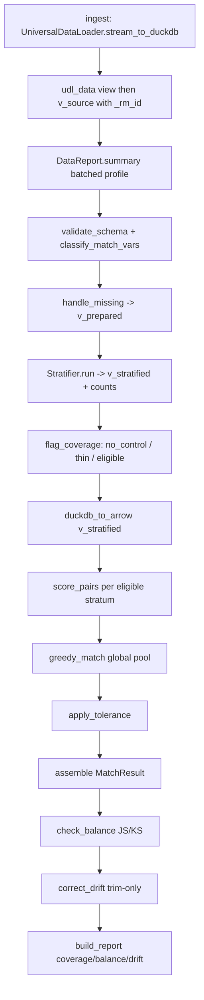

# RapidMatch (RiMatch) — Code Graph for LLMs

Read this file first. It is the map of the running code. `plan.md` is the
locked product design (14 modules). This file describes what is actually
built today (modules 1-13). Module 14 (FastAPI) is deferred.

Pronunciation: RiMatch = "rematch". Package import name: `rapidmatch`.

---

## 1. What this library does in one paragraph

Given a table with a binary treatment flag (`1` = campaign target, `0` = not
targeted) plus pre-campaign features, RapidMatch builds a **control group
from the `0` rows whose feature distribution mirrors the `1` group**. Matching
is fully rule-based: quantile bins on the target, composite strata, global
z-score, weighted Euclidean distance, greedy assignment without replacement,
global strength cutoff. No ML.

---

## 2. Public API (the only things a caller needs)

```python
from rapidmatch import ControlMatcher, MatchConfig, MatchResult

config = MatchConfig(
    match_vars=["income", "age", "region"],
    treatment_col="is_target",
    id_col="id",                  # optional business id
    weights={"income": 1.5},      # unspecified vars default to 1
    n=1,                          # matches per target
    tolerance=0.2,                # keep pairs at/above this strength quantile
    min_control_pool_size=5,
    n_bins=4,
    monitor_vars=["tenure"],      # optional; JS/KS + trim if flagged
    js_threshold=0.10,
    ks_threshold=0.05,
)
result: MatchResult = ControlMatcher(config).fit_match(df)  # or a file path
result.pairs              # pair-level table
result.targets            # one row per target
result.coverage_summary   # counts / pct_matched / cutoff
result.cutoff
result.report             # Module 13: coverage / balance / drift_log / data_profile
result.report.balance     # before/after JS or KS per variable
result.report.drift_log   # rows trimmed from over-represented monitor groups
```

Entry point: `rapidmatch/pipeline.py` -> `ControlMatcher.fit_match`.

---

## 3. Directory map (one job per folder)

```text
rapidmatch/
  __init__.py                 public exports
  config.py                   Module 3  MatchConfig dataclass + validation
  pipeline.py                 wires modules 1-13 in order
  _sql.py                     quote_ident for DuckDB identifiers
  ingestion/
    data_loader.py            VENDORED RapidSegment UniversalDataLoader
    ingest.py                 Module 1  route input -> .duckdb + MatchSession
    validate.py               schema / binary-treatment / numeric vs cat
  data_report/
    report.py                 Module 2  lazy batched nulls + type + target counts
  missingness/
    handle_missing.py         Module 4  sentinel + is_missing_* flags
  binning/
    stratifier.py             Module 5  orchestrator (table of contents)
    compute_bin_edges.py      quantile cuts from TARGET only
    apply_bucket.py           CASE SQL assigning bin indices
    build_stratum_key.py      concat bins + cats + missing flags
    get_stratum_counts.py     GROUP BY target/control counts
  coverage/
    flag_coverage.py          Module 6  no_control / thin / eligible
  scoring/
    scorer.py                 Module 7  global z-score, weighted Euclidean, exp(-d)
  matching/
    greedy_match.py           Module 8  global sort + walk, no replacement
  tolerance/
    apply_tolerance.py        Module 9  global strength quantile cutoff
  output/
    assemble.py               Module 10 MatchResult tables + coverage_summary
  balance/
    checker.py                Module 11 orchestrator (JS/KS vs thresholds)
    js_distance.py            categorical Jensen-Shannon divergence
    ks_statistic.py           numeric two-sample KS statistic
  drift/
    diagnose.py               over-represented categories/bins vs target share
    correct.py                Module 12 trim-only, weakest matches first
  reporting/
    report.py                 Module 13 orchestrator
    build_coverage_summary.py coverage percents + cutoff
    build_balance_table.py    before/after JS/KS table
    build_drift_log.py        audit of trimmed control rows
tests/                        1:1 with the step files above
demo.py                       CLI smoke run
demo.ipynb                    interactive walkthrough
plan.md                       locked product design (source of truth)
```

Convention (plan.md section 3a): pipeline modules = one file per step;
cohesive objects (config) stay one file; trivial `_` helpers stay with their
one caller.

---

## 4. Runtime data flow

DuckDB views are the source of truth until scoring. Then a stratum-scoped
Arrow/pandas subset is pulled for NumPy.



### DuckDB objects created in order

| object | created by | meaning |
|---|---|---|
| `udl_data` | UniversalDataLoader | persisted table/view of the input |
| `v_source` | ingest.py | `udl_data` plus `_rm_id` (ROW_NUMBER) |
| `v_prepared` | handle_missing.py | imputed match_vars, `_treatment`, missing flags |
| `v_stratified` | stratifier.py | plus `_bin_*` columns and `_stratum` |

Internal columns (`_rm_id`, `_treatment`, `_stratum`, `_bin_*`,
`is_missing_*`) are pipeline bookkeeping. They are not match_vars.

---

## 5. Module contracts (inputs / outputs / invariants)

### Module 1 — ingestion (`ingestion/ingest.py`)

- **In:** file path or pandas/Arrow object, optional `work_dir`.
- **Out:** `MatchSession` (open DuckDB connection, `db_path`, cleanup).
- **Route:**
  - csv/tsv/parquet/feather: `UniversalDataLoader(file_path=...).stream_to_duckdb(..., scorer_view_name=None)`
  - excel: `.load()` then `stream_to_duckdb(data=table)` then `del table`
  - in-memory: `stream_to_duckdb(data=obj)`
- **Invariant:** loader closes its own connection and returns a path string.
  We `duckdb.connect(path)` ourselves. Always read `udl_data`.
- **Cleanup:** `MatchSession.close()` drops the temp `.duckdb` unless `keep_db=True`.

### Module 3 — config (`config.py`)

- Frozen dataclass. Validation errors name the bad field.
- `match_vars` and `monitor_vars` must not overlap.
- Weight keys must be a subset of `match_vars`.
- `monitor_vars` are accepted but unused in the MVP (reserved for modules 11-13).

### Module 4 — missingness (`missingness/handle_missing.py`)

- Numeric null -> 0 AND `is_missing_<var>` boolean.
- Categorical null -> `"__MISSING__"`.
- Flags join the stratum key. They are excluded from distance.

### Module 5 — binning (`binning/`)

- Edges: `quantile_cont` on `_treatment = 1` only.
- Apply the same edges to control.
- Stratum key = `_bin_<num>` + categorical values + `is_missing_<num>`.
- Counts: one `GROUP BY _stratum`.

### Module 6 — coverage (`coverage/flag_coverage.py`)

- `n_control == 0` -> `no_control` (not scored).
- `0 < n_control < effective_min` -> `thin` AND still `eligible`.
- Decision locked for MVP: **thin strata are still matched, flagged**.
- `thin_stratum` is a boolean on the output, not a `match_status` value.

### Module 7 — scoring (`scoring/scorer.py`)

- Mean/std of numeric match_vars computed **once on the whole target group**.
- Per eligible stratum: all target x control pairs.
- `match_strength = exp(-weighted_euclidean(z))`, bounded `(0, 1]`.
- Identical rows (after z-score + weight) have strength 1.0.
- Categorical-only stratum: distance 0, strength 1 for every pair in the cell.

### Module 8 — matching (`matching/greedy_match.py`)

- Concatenate every stratum's pairs into one list.
- Sort strength descending (`mergesort` = stable ties).
- Walk: assign if control unused and target has an open slot of `n`.
- A control row is used at most once, ever.

### Module 9 — tolerance (`tolerance/apply_tolerance.py`)

- Cutoff = `quantile(accepted_strengths, tolerance)`.
- `tolerance=0` keeps all; `tolerance=0.8` keeps the strongest 20%.
- Targets with zero kept pairs land in `below`.

### Module 10 — output (`output/assemble.py`)

`match_status` values:

| status | meaning |
|---|---|
| `matched` | at least one pair survived tolerance |
| `no_control_available` | stratum had zero control rows |
| `below_tolerance` | had assignments, all fell below cutoff |
| `unmatched` | eligible but lost every control slot to stronger pairs |

`thin_stratum` can be True on a `matched` row.

---

## 6. Call graph of `ControlMatcher._run`

```text
fit_match(data)
  ingest(data)                                # MatchSession
  _run(session)
    validate_schema(con, config)              # types dict
    classify_match_vars(types, match_vars)    # numeric, categorical
    handle_missing(con, treatment, num, cat)  # v_prepared
    Stratifier(n_bins).run(con, num, cat)     # v_stratified, counts, edges
      compute_bin_edges
      bucket_sql (per numeric var)
      stratum_key_sql
      get_stratum_counts
    flag_coverage(counts, ...)                # Coverage
    UniversalDataLoader.duckdb_to_arrow(...)  # pandas frame
    target_moments(x[target])                 # global mean/std
    for stratum in coverage.eligible:
      score_pairs(...)                        # ids + strengths
    greedy_match(all pairs, n)
    apply_tolerance(assignments, tolerance)
    check_balance(...)                        # before JS/KS
    correct_drift(...)                        # trim flagged monitor groups
    check_balance(...)                        # after JS/KS
    assemble(...)                             # MatchResult
    build_report(...)                         # coverage / balance / drift / profile
  session.close()                             # always, even on error
```

---

## 7. Invariants any change must preserve

1. No control row reused (without replacement).
2. `match_strength` in `(0, 1]`.
3. Bin edges derived from target (`_treatment=1`) only.
4. Z-score moments are global on the target group, never per stratum.
5. Every target row appears in `result.targets` (never silently dropped).
6. Missing flags affect stratification only, not distance.
7. pandas is not used for computation (parser / final tables only).
8. DuckDB connection is opened by us after `stream_to_duckdb` returns a path.
9. Temp `.duckdb` files are deleted on success and on error unless `keep_db`.
10. `thin_stratum` rows still go through matching.
11. DataReport is lazy: constructing it does not query; `.summary()` does, once.
12. Drift correction only *removes* excess control rows (no same-stratum swap-in).
13. Weakest `match_strength` rows are trimmed first.

---

## 8. What is NOT built yet (plan.md modules)

- Module 14 FastAPI layer (intentionally last; do not start it here)

---

## 9. How to extend without breaking the Lego shape

- New pipeline step: new folder, one public function, import it in
  `pipeline.py` at the right point. Do not fold it into an existing file
  unless it is a private helper of exactly one caller.
- New config knob: add the field + validation in `config.py` only.
- Tests: `tests/<module>/test_<step>.py` matching the step file.
- Do not reimplement file readers — call `UniversalDataLoader`.
- Do not add PySpark or sklearn.

---

## 10. Tests and how to run

```text
python3 -m pytest tests -q
python3 demo.py
```

Key tests:

- `tests/matching/test_greedy_match.py` — control never reused; n-slots
- `tests/scoring/test_scorer.py` — strength bounds; identical -> 1.0
- `tests/binning/test_compute_bin_edges.py` — edges ignore huge control outliers
- `tests/coverage/test_flag_coverage.py` — thin stays eligible
- `tests/test_pipeline.py` — every target accounted for; no reused control; report attached
- `tests/data_report/test_data_report.py` — lazy until `.summary()`, batched counts
- `tests/balance/test_js_ks.py` — identical samples -> 0
- `tests/drift/test_correct.py` — over-represented category is trimmed
- `tests/reporting/test_build_report.py` — coverage / balance / drift_log assembled

---

## 11. Vendor note

`rapidmatch/ingestion/data_loader.py` is a copy of RapidSegment
`UniversalDataLoader`. Treat it as an upstream dependency that happens to
live in-tree. Do not rewrite it. If upstream changes, replace the file.
