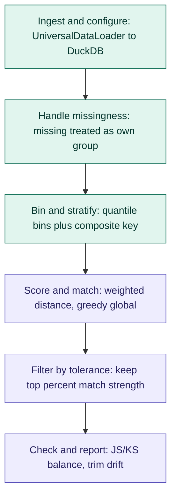
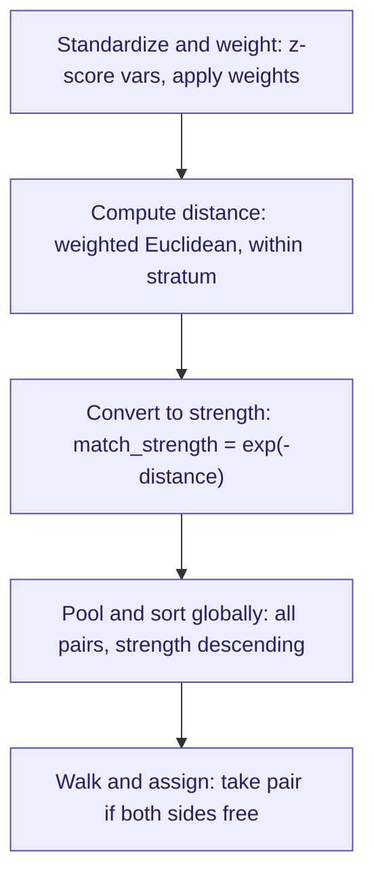

# Plan.md — RapidMatch (RiMatch) Matching & Downsampling

**Status:** Matching v1 is implemented (Modules 1-13) as the `rapidmatch` Python
package. DuckDB production path, full-target comparison, and the global
control-pool warning are live. Module 14 (FastAPI) is not started.
**Next increment (2026-10-04):** stratum-capacity diagnostics, actionable tuning
recommendations, separate grouping/scoring roles, and exact-size proportional
stratified random downsampling. Product direction approved; the implementation
plan in §4 is awaiting review before any code changes. All §4 work is unimplemented.
`UniversalDataLoader` is vendored from RapidSegment into
`rapidmatch/ingestion/data_loader.py`. Running-code map: `codegraph.md`.
See §8 Changelog for details.
**Purpose:** This file is the source of truth for the project. It is updated every time a
decision changes, a module is completed, or a new requirement is added. Any LLM or
collaborator picking up this project should be able to read this file alone and know
exactly what's decided, what's built, and what's left.

**Package:** RapidMatch (short form **RiMatch**, pronounced "rematch"). Import name:
`rapidmatch`. Public entry: `ControlMatcher(MatchConfig(...)).fit_match(data)`.

---

## 1. Objective

Build a simple, explainable (no ML/black-box) Python tool that takes a dataset with a
mix of numeric and categorical columns plus a binary treatment flag
(`1` = campaign target, `0` = not targeted), and constructs a **control group from the
`0` rows whose pre-campaign feature distribution closely mirrors the `1` group**.

This control group is used to measure the real impact of a campaign, isolated from
pre-existing differences in customer attributes between who was targeted and who
wasn't. All matching features must be **pre-campaign** — this is what makes the
comparison fair (no data leakage from the treatment itself).

The final pseudo-control comparison must always use the **full target group**.
Comparing only the subset of targets that received a match is not an accepted
final analysis. Controls are unique: a control row may be assigned at most once
and may never be reused. When the available control pool or feature overlap
cannot support full coverage, RapidMatch must report that limitation rather than
silently changing the target population or reusing controls.

The approved next increment also supports memory-driven downsampling of an ML
training population or other user-supplied dataset. This entry point needs no
treatment column: it selects exactly the user-requested number of unique source
rows, allocates sample slots proportionally across chosen strata, and checks the
sample against the **whole supplied population**. Details and review items: §4.

## 2. Prior direction (superseded)

An earlier version of this project explored a generic, population-representative
sampling library (`repsample`) using a pluggable PySpark/PyArrow backend, targeting
"sample looks like the whole population" rather than "control looks like target."
That code was built but has been **discarded** — this document supersedes it.
The implemented library is purpose-built for treatment/control matching using
DuckDB, PyArrow, and NumPy (no PySpark). The new downsampling feature in §4 will
share this library's infrastructure; it does not restore the discarded backend
architecture or code.

## 3. Locked design decisions (matching v1)

This section describes the implemented matching contract. Planned extensions and
the separate downsampling contract are in §4; they are not implemented APIs yet.

| Decision | Choice |
|---|---|
| Package name | RapidMatch (RiMatch). Import: `rapidmatch`. Not `repmatch`. |
| Input formats | CSV, TSV, Parquet, Feather/Arrow, PyArrow Table, pandas DataFrame, Excel — ingested via RapidSegment's `UniversalDataLoader` (vendored copy at `rapidmatch/ingestion/data_loader.py`), not custom readers |
| Ingestion entry point | `stream_to_duckdb()` (default). Confirmed from source: for CSV/TSV/Parquet/Feather file paths it calls DuckDB's own `read_csv_auto`/`read_parquet`/`read_ipc` directly — the file never becomes a Python object at all. For PyArrow Table / pandas DataFrame / any DuckDB-registrable object passed as `data=`, it registers + `CREATE TABLE AS SELECT`, i.e. one materialization pass, since the object is already unavoidably in RAM by the time it reaches us. **Excel is the one path that can't be streamed directly** — the loader's own docstring requires calling `.load()` first (parses via openpyxl into a PyArrow Table in RAM), then passing that table to `stream_to_duckdb(data=...)`. After that call, we explicitly `del` our reference to the intermediate table so it's GC-eligible. `.load()` alone (pure in-memory PyArrow, no persistence) stays available as an explicit opt-in for small data / prototyping |
| Ingestion → our pipeline boundary | `stream_to_duckdb()` closes its own DuckDB connection and returns a plain file path (`str`), not a live connection or relation. **Our code owns the connection from that point on** — we call `duckdb.connect(path)` ourselves, and everything after that is where our lazy-evaluation principle applies. It always creates a fixed alias view named `udl_data` regardless of the table name used internally, so our code can just always read from `udl_data` rather than tracking a custom name. We pass `scorer_view_name=None` since that alias is for a different RapidSegment component we don't use |
| Numeric type convention | The loader casts all numeric columns to `DOUBLE`/`float64` automatically, both in `load()` and `stream_to_duckdb()`. Our binning/z-scoring code can rely on this — no mixed int/float handling needed |
| Internal representation | The disk-backed DuckDB table (`udl_data`) is the source of truth for anything at scale. A PyArrow Table only exists transiently: (a) if the user explicitly chose `.load()`, (b) for the unavoidable Excel intermediate step, or (c) for the final, stratum-scoped subset pulled back for Score & Match via `UniversalDataLoader.duckdb_to_arrow()` |
| Compute engine | DuckDB, operating directly on the disk-persisted table via a connection we open and own after ingestion hands off |
| Evaluation model | **Lazy by default**, starting from the moment we open our own connection to the ingested `.duckdb` file. Build up relations by chaining; execute only at a genuine terminal point. Laziness deliberately breaks at named checkpoints: data report `.summary()` (Module 2), bin edges (Module 5), stratum counts for coverage/`thin_stratum` checks (Module 6), and the final stratum-scoped subset handed to Python/NumPy before scoring (Module 7). Each checkpoint should be obvious in the code, not hidden inside a helper |
| pandas usage | Only as a one-time parser for Excel / pandas-in-memory inputs — never for computation |
| ML usage | None. Fully rule-based and explainable end to end |
| Binning | Quantile bins computed on the **target (1)** group, applied to control (0) |
| Stratification | Binned numeric vars + categorical vars (+ missingness flags) → composite stratum key |
| Missing values | Sentinel-imputed for distance math; a companion `is_missing_<var>` flag joins the stratum key so missing only matches missing. Categorical missing = its own literal category |
| Distance metric | Standardized, weighted Euclidean distance within a stratum. Standardization (z-score) is computed **globally** across the whole target group, not per stratum — keeps `match_strength` comparable across strata, which the global greedy matching and global tolerance filter both depend on |
| Variable weights | User-supplied `dict[var, weight]`; unspecified vars default to `1` |
| Match strength | `exp(-distance)`, bounded (0, 1] |
| Matching algorithm | Global greedy-edge matching: pool all valid pairs across strata, sort by strength descending, walk the list assigning if both sides are still free. **No Hungarian algorithm, no ML** |
| Matching ratio | 1:1 default, 1:n supported (n user-defined) |
| Replacement | Sampling without replacement always — a control row is used at most once, ever |
| Tolerance | Global percentile quality cutoff (not per-stratum). Weaker secondary assignments are filtered, but each target's strongest unique assignment is preserved for full-target analysis |
| Uncovered target rows | Kept in output, not silently dropped, labeled via `match_status` |
| Final comparison population | Balance and downstream analysis compare the full target group against the available unique pseudo-control group; matched-target-only analysis is not valid |
| Control capacity warning | After profiling, warn when `n_control < n_target`: full unique 1:1 coverage is impossible without reuse; continue running and report the capacity shortfall |
| Coverage versus quality | Maximize unique target coverage where possible; surface weak assignments as quality diagnostics; never reuse a control |
| Min control pool per stratum | `min_control_pool_size` (default `5`, absolute floor) and optional `min_control_ratio` (control candidates required per target row in that stratum). Effective minimum = `max(min_control_pool_size, ceil(min_control_ratio × target_count_in_stratum))` when a ratio is given, else just the flat floor. Strata below this are labeled `thin_stratum` — separate from `no_control_available` (which means literally zero candidates). **Locked:** `thin_stratum` rows still proceed through matching and are flagged via a boolean that can co-occur with `matched` |
| Variable roles | `match_vars` (stratify + distance) vs. `monitor_vars` (post-hoc balance check only, not used to match) |
| Balance metrics | After matching, one number per column asking "do the two groups still look alike?" Categories: JS (mix / recipe; 0 = identical, 1 = nothing in common). Numbers: KS (biggest gap between the two sorted lineups). Both run on `match_vars` (sanity) and `monitor_vars` (primary) |
| Drift correction | If a `monitor_var` is flagged post-hoc, identify the specific over-represented rows/groups causing it and trim them from control |

## 3a. Code structure & modularity

**Rule: one file per independently meaningful, testable unit of logic — not
literally one file per function.** Taking "modular" to mean every single
function gets its own file is a known anti-pattern (file-explosion that hurts
navigability more than it helps). The rule adapts to what each module
actually *is*:

**Pipeline modules** (a sequence of distinct transformations) — one file per
step, with a class that imports and calls them in order. The class becomes a
readable table of contents for the whole module. Example — Module 5
(Binning & Stratification):
```
binning/
  stratifier.py          # class Stratifier -- orchestrates the four files below
  compute_bin_edges.py
  apply_bucket.py
  build_stratum_key.py
  get_stratum_counts.py
```

**Single cohesive object modules** (no natural sequence of steps) — stays as
one file for the object. Example — Module 3 (Configuration): a single
`config.py` holding the dataclass, plus a separate `validate.py` only if
validation logic is substantial enough to deserve its own tests. Forcing a
dataclass into several one-line files would hurt readability, not help it.

**Multi-artifact modules** (produce several independent outputs) — decompose
by *artifact*, not by function. Example — Module 13 (Reporting):
```
reporting/
  report.py                  # class Report -- assembles the three builders below
  build_coverage_summary.py
  build_balance_table.py
  build_drift_log.py
```

**Trivial private helpers** (prefixed `_`) used by exactly one function stay
colocated with their caller — they're promoted to their own file only once a
*second* caller genuinely needs them, not preemptively.

**Testing:** every step-file gets a matching test file
(`tests/binning/test_compute_bin_edges.py`), so there's a 1:1 mapping between
a unit of logic and a unit of test coverage.


Status legend: `[ ]` not started · `[~]` in progress · `[x]` done

### Module 1 — Ingestion & normalization
Code: `rapidmatch/ingestion/ingest.py`, `rapidmatch/ingestion/validate.py`. Loader vendored at `rapidmatch/ingestion/data_loader.py`.
- [x] Detect input kind and route accordingly:
      CSV/TSV/Parquet/Feather file path → `UniversalDataLoader(file_path=path).stream_to_duckdb(db_path=<work_dir>, scorer_view_name=None)`
      Excel file path → `table = UniversalDataLoader(file_path=path).load()`, then `UniversalDataLoader().stream_to_duckdb(data=table, db_path=<work_dir>, scorer_view_name=None)`, then `del table`
      In-memory PyArrow Table / pandas DataFrame → `UniversalDataLoader().stream_to_duckdb(data=obj, db_path=<work_dir>, scorer_view_name=None)`
- [x] Reopen our own connection to the returned `.duckdb` path (`duckdb.connect(path)`) — this is the handoff point from RapidSegment to our own lazy pipeline
- [x] Always read from the `udl_data` view (the fixed alias RapidSegment always creates) rather than tracking a custom table name
- [x] Basic schema validation against `udl_data` (target column exists, is binary, match/monitor vars exist) — via `information_schema`, no data scan needed
- [x] `work_dir` parameter (where the temp `.duckdb` file lives) — user-configurable, matters for I/O throughput at 7M-row scale
- [x] Lifecycle management: a session/context-manager object owns the `.duckdb` file path and guarantees cleanup on success *and* on error, so this never leaves orphaned files behind (`MatchSession`)

### Module 2 — Data report
Built from scratch — confirmed via source review that RapidSegment's loader contains
no profiling logic itself, so there's nothing to wrap here.
Code: `rapidmatch/data_report/report.py` (`DataReport`).
- [x] Single **batched** DuckDB query computing null counts for every column + target/control
      row counts together in one pass — not one query per column. At 7M rows, the
      difference is "profiling is instant" vs. "profiling silently costs a full scan per column"
- [x] Column type counts (categorical vs. numeric) via `information_schema.columns` —
      metadata only, no data scan needed
- [x] Target row count vs. non-target row count (the one thing specific to us that a
      generic loader has no concept of)
- [x] Emit an `InsufficientControlPoolWarning` when `n_control < n_target`, stating
       that no-reuse matching cannot provide full unique 1:1 coverage. This is a
       warning, not a hard failure; the run continues and reports the shortfall.
- [x] Lazy by default: building the report object triggers nothing; only calling
      `.summary()` / `.to_dict()` actually runs the query

### Module 3 — Configuration
Code: `rapidmatch/config.py` (`MatchConfig`).
- [x] Public API accepts: `match_vars`, `monitor_vars`, `weights` (dict, default 1), `priority_var` semantics folded into `weights`, `n` (matches per target row, default 1), `tolerance` (global percentile, strict default), `treatment_col`, `min_control_pool_size` (default `5`), `min_control_ratio` (optional, default `None`), plus `js_threshold` / `ks_threshold` for Module 11
- [x] Sensible validation + clear error messages for misconfiguration (e.g. overlapping match/monitor vars, unknown weight keys)

### Module 4 — Missing value handling
Code: `rapidmatch/missingness/handle_missing.py`.
- [x] Numeric: sentinel imputation + `is_missing_<var>` boolean flag added to stratum key
- [x] Categorical: missing mapped to explicit `"__MISSING__"` category
- [x] Confirm missing-flag columns are excluded from the distance calculation itself (they only affect stratification, not scoring)

### Module 5 — Binning & stratification (DuckDB)
Code: `rapidmatch/binning/` (`Stratifier` + step files). DuckDB SQL is the production path.
- [x] Compute quantile bin edges per numeric `match_var` from the **target group**, via DuckDB
- [x] Apply target-derived edges to the control pool
- [x] Build composite stratum key = binned numeric vars + categorical vars + missingness flags
- [x] `GROUP BY` in DuckDB to get target/control counts per stratum in one pass

### Module 6 — Coverage flagging
Code: `rapidmatch/coverage/flag_coverage.py`.
- [x] Identify target rows whose stratum has zero control rows
- [x] Keep them in the output, label `match_status = "no_control_available"`
- [x] Identify strata with fewer control candidates than the effective minimum (`min_control_pool_size` / `min_control_ratio`, see §3) and label their target rows `thin_stratum`
- [x] **Locked:** `thin_stratum` rows still proceed through matching and are flagged as lower-confidence (`thin_stratum` boolean, can co-occur with `matched`)

### Module 7 — Scoring
Code: `rapidmatch/scoring/scorer.py`, `rapidmatch/scoring/score_strata.py`. Production path is NumPy on the Arrow pull from `v_stratified`.
- [x] Compute mean/std per numeric `match_var` **globally** across the target group (not per stratum)
- [x] Apply global z-score standardization to numeric `match_vars` on both target and control rows
- [x] Apply user weight dict (default 1) per variable to the standardized (z-scored) values
- [x] Compute weighted Euclidean distance for every valid target–control pair within a stratum
- [x] Transform distance → `match_strength = exp(-distance)` — confirmed bounded in (0,1]
- [x] Identity-preserving speed: one forward scan into per-stratum slices; large 3D
      distance tensors scored in target-row chunks (`_MAX_DISTANCE_CELLS = 16e6`);
      pair ids via `repeat`/`tile` (same order as the old meshgrid). Bit-identical
      strengths. `n_workers` remains opt-in and order-preserving.

### Module 8 — Matching (global greedy, without replacement)
Code: `rapidmatch/matching/greedy_match.py`.
- [x] Pool all candidate pairs across every stratum into one list
- [x] Sort globally by `match_strength` descending
- [x] Walk the sorted list; assign a pair only if the target row has an open slot (of `n`) and the control row is unused; otherwise skip — no control row reused
- [x] Support `n` > 1 via per-target virtual slots — unit-tested at n=1 and n=2
- [x] Occupancy is a boolean / int32 mask of length `max(_rm_id)+1` (dense 1-based
      ids), not a Python `set`. Same walk, same assignments.

### Module 9 — Tolerance filtering
Code: `rapidmatch/tolerance/apply_tolerance.py`.
- [x] Apply global percentile cutoff to accepted pairs (`cutoff = quantile(strengths, tolerance)`)
- [x] Filter secondary pairs below cutoff while preserving each target's strongest
       unique assignment for full-target analysis
- [x] In the full-target coverage policy, do not use the cutoff to silently
       redefine the analysis population. Preserve a target's best unique
       assignment when it is needed for coverage, and expose weak quality in the
       result/report instead of dropping the only available control.

### Module 10 — Output assembly
Code: `rapidmatch/output/assemble.py` (`MatchResult`).
- [x] Attach `match_strength`, `match_rank` (1 = best), `match_status` (`matched` / `no_control_available` / `below_tolerance` / `unmatched`) to every target row and its matched control row(s)
- [x] `thin_stratum` is informational and can co-occur with `matched` (separate boolean flag alongside `match_status`)
- [x] Preserve full-target accounting in the output and report the number of
       unique controls actually available. Never claim full coverage when the
       no-reuse capacity or overlap constraints make it impossible.

### Module 11 — Post-hoc balance validation
Code: `rapidmatch/balance/` (`checker.py`, `js_distance.py`, `ks_statistic.py`).
- [x] After matching, one number per column: are the two groups still similar?
      Categories use JS ("did the mix / recipe change?" — 0 = same, 1 = nothing
      in common). Numbers use KS ("where do the two sorted lineups drift the
      most?" — the single biggest gap in the share of each group at or below
      each value). Computed for `match_vars` (sanity — should already be tight)
      and `monitor_vars` (primary check)
- [x] Flag columns exceeding threshold (JS > 0.10, KS > 0.05, configurable via `js_threshold` / `ks_threshold`)
- [x] Lock the final comparison scope to all target rows versus the unique
       pseudo-control rows; downstream examples must not replace the full target
       group with only matched targets.

### Module 12 — Drift diagnosis & correction
Code: `rapidmatch/drift/diagnose.py`, `rapidmatch/drift/correct.py`. Trim-only (no swap-in). Weakest `match_strength` rows dropped first.
- [x] For flagged `monitor_vars`, identify over-represented categories/bins in control vs. target
- [x] Pinpoint the specific control rows causing the excess
- [x] Remove just enough of them to bring the group back to the target's share
- [x] Report exactly what was removed and why (column, group, row count) for auditability

### Module 13 — Reporting
Code: `rapidmatch/reporting/` (`Report` + three builders). Attached as `MatchResult.report`.
- [x] Coverage summary (% matched / no control / below tolerance)
- [x] Tolerance cutoff value actually used
- [x] Before/after balance table for `match_vars` and `monitor_vars`
- [x] Drift-correction log (what got trimmed, from Module 12)

### Module 14 — API layer (FastAPI)
**Sequencing note:** this comes *after* the core library (Modules 1–13) is built and
working as a standalone Python package. The API is a thin serving layer on top, not
built in parallel.
- [ ] Wrap the core matching pipeline in a FastAPI app so it can be served from a
      Python server (e.g. `POST /match` accepting a dataset reference/config, returning
      the matched table + report)
- [ ] Define request/response schemas (pydantic models) mirroring the config in
      Module 3 (`match_vars`, `monitor_vars`, `weights`, `n`, `tolerance`,
      `min_control_pool_size`, `min_control_ratio`, etc.)
- [ ] Decide on data I/O for the API: upload file vs. path/URI reference vs. reading
      from a shared location — TBD when we get here
- [ ] Async/background job handling for large (7M-row) requests, since matching won't
      complete within a single synchronous request cycle
- [ ] Basic error handling + validation responses (e.g. missing treatment column,
       unknown variable names)

## 4. Next increment — capacity guidance & exact-size downsampling

**Status:** Product direction approved on 2026-10-04. This is a documentation-only
implementation proposal for user review. Complete that review before changing
application code. The existing module completion marks above describe matching
v1, not the work below. FastAPI remains deferred.

### 4.1 Agreed outcomes

1. Warn before pairwise scoring when the current strata cannot supply the requested
   unique controls, even if the total control pool is large enough.
2. Recommend specific settings to change, explaining the expected benefit and
   trade-off. Distinguish measured preflight results from untested suggestions.
3. Allow fewer hard grouping features while retaining more features for similarity
   scoring; keep existing `MatchConfig` callers backward-compatible.
4. Add `rapidmatch.random_downsample`, with **proportional stratified random
   sampling as the default** and no required treatment column or artificial 1/0
   assignment.
5. The user supplies `sample_size`. A successful call returns **exactly that many
   rows**, without replacement. Recommendations never change the requested size
   or grouping configuration automatically.

### 4.2 Matching: capacity diagnostics and actionable recommendations

**Timing:** extend the coverage checkpoint after DuckDB stratum counts and before
the Arrow pull / distance scoring. Reuse counts already computed for the run.

Keep these independent facts visible for every target-bearing stratum:

| Indicator | Meaning |
|---|---|
| No controls | `C_s = 0`; matching in this stratum is impossible |
| Capacity shortfall | `C_s < n * T_s`; not enough unique controls for the requested ratio |
| Thin pool | Pool below `min_control_pool_size` / `min_control_ratio`; limited candidate choice, but still eligible |

`T_s` and `C_s` are target and control counts; `n` is the requested controls per
target. A stratum with 100 targets and 50 controls is insufficient for 1:1 even
though it exceeds the default pool floor of five. A stratum with two targets and
three controls is thin under that floor but can support 1:1.

For 1:1, compute:

```text
capacity_ceiling     = sum_s min(T_s, C_s)
unavoidable_shortfall = sum_s max(0, T_s - C_s)
coverage_ceiling     = capacity_ceiling / total_target_count
```

For 1:n, report separate quantities rather than conflating assignments with
covered targets:

```text
requested_assignments          = n * total_target_count
assignment_capacity_ceiling    = sum_s min(n * T_s, C_s)
assignment_shortfall           = sum_s max(0, n * T_s - C_s)
targets_with_one_control_ceiling = sum_s min(T_s, C_s)
fully_supplied_targets_ceiling = sum_s min(T_s, floor(C_s / n))
```

These are structural upper bounds before candidate pruning, greedy allocation,
tolerance filtering, and drift trimming; they are not promises of final coverage
or balance. Surplus controls in one stratum cannot cover another stratum's deficit.

**Report:** one aggregate warning plus an inspectable stratum table, not a warning
per stratum. Include counts, requested ratio, capacity ceilings, unavoidable
shortfall, number of deficient strata, targets in deficient strata, and thin/no-
control indicators. Distinguish all targets exposed to a deficit from the smaller
number necessarily left without controls. Show readable grouping values/bin
ranges and sort the detail table by shortfall. Attach diagnostics to the result
report without changing existing match statuses or coverage-key meanings.

**Preflight proposal:** add an explicit assessment operation, provisionally
`ControlMatcher.assess(data, n_bins_candidates=[4, 3, 2])`. It profiles and counts
candidate stratifications without scoring or matching, using one ingested source.
Ordinary `fit_match` runs get the lightweight current-setting diagnostic; broader
what-if scans are opt-in. Exact public names/report types are review items.

For each trial, report the actual bin setting, capacity ceiling, shortfall,
target-bearing strata, total candidate pairs `sum_s T_s * C_s`, and largest
stratum pair count. With candidate cap `K`, also report retained-candidate count
`sum_s T_s * min(C_s, K)`. The cap bounds retained pairs, not distance work or total
process memory. Use sufficiently wide arithmetic for large pair counts.

Each recommendation states **setting, proposed value, reason, evidence, and
trade-off**. Evaluate valid candidate settings rather than assuming fewer bins
always improve coverage; recomputed quantile partitions need not be nested.

| Cause | Recommendation and limits |
|---|---|
| Global control shortage | Explain the fixed-population limit and suggest a larger eligible control pool. Fewer bins or weaker quality thresholds cannot create rows. |
| Sparse numeric combinations | Try fewer bins (minimum two under the current config), compare capacity and candidate-pair work, and recheck balance after matching. |
| Too many hard grouping features | Suggest a smaller user-selected stratification set while retaining appropriate similarity features. Never remove a constraint automatically. |
| High-cardinality categories or missingness patterns | Identify the fragmentation; suggest review of meaningful category grouping or feature roles, subject to the missingness policy in §4.3. |
| Candidate pruning limits achieved matching | Explain that increasing `max_candidates_per_target` may help at a retained-memory cost; stratum counts alone do not prove pruning caused a particular loss. |
| Drift trimming reduces final coverage | Point to the drift log and affected monitor groups rather than claiming a bin change will fix it. |

Do not recommend lowering `min_control_pool_size` as a coverage fix: thin strata
already match. Lowering `tolerance` cannot recover unassigned 1:1 targets because
the pipeline already preserves primary assignments. When no tested setting can
meet the requested ratio, say so and report the best tested capacity, not a
guaranteed solution. Final balance always retains the full target reference.

### 4.3 Matching: separate hard grouping from similarity scoring

With 100 numeric features, even two bins per feature permit `2**100` combinations.
Only observed strata are materialized, but many can be tiny or lack controls.
Reducing `n_bins` alone may therefore be insufficient.

**Proposed backward-compatible shape for review:** add optional `stratify_vars`
to `MatchConfig`, as a subset of `match_vars`. `None` preserves today's behavior:
all matching features form strata. An explicit subset limits numeric binning to
that subset, while all numeric `match_vars` continue to contribute to weighted
distance using global target moments. `monitor_vars` retain their current role.
This provides the grouping/scoring distinction without requiring existing callers
to migrate to a new `score_vars` parameter.

Two edge policies must be reviewed explicitly:

- **Categorical similarity:** the current distance is numeric only. Proposed first
  version requires categorical `match_vars` to remain in `stratify_vars`; reject
  attempts to exclude them rather than silently ignore them or invent a new
  categorical distance. Users can explicitly move a variable to monitoring.
- **Score-only missingness:** proposed first version preserves missing-only-matches-
  missing for all numeric matching features, including score-only features. Their
  missingness flags remain hard constraints, never distance inputs. The report
  must explain that varied missingness patterns can still fragment strata. A
  relaxed policy would need a separate design decision.

Update validation, preparation, stratification, projected pulls, capacity trials,
and balance-variable selection consistently. Omitting the new option must preserve
existing pairs, strengths, ranks, and statuses. Match bin edges and z-moments
remain target-derived; the population-derived sampling bins below are a separate
contract.

### 4.4 Downsampling: public contract and proportional allocation

**Proposed API (not yet available):**

```python
from rapidmatch import random_downsample

result = random_downsample(
    data="training_data.parquet",
    sample_size=25_000,  # User chooses this; there is no fixed output size.
    stratify_vars=["region", "age", "income"],
    check_vars=["tenure", "spend", "visits"],
    n_bins=4,
    random_state=42,
)

sample = result.sample  # PyArrow Table: exactly 25,000 source rows.
report = result.report
```

- `sample_size` is a required positive integer (not a boolean), at most population
  size `N`. Invalid requests and positive requests on empty input raise clear
  errors. `sample_size == N` returns every source row once.
- No treatment column, target/reference split, or pairwise distance scoring is
  needed. The full user-supplied dataset is the reference population.
- Accept the existing supported input kinds through `UniversalDataLoader`. Reuse
  session ownership/cleanup; treat the vendored loader as an upstream dependency.
- Proposed defaults: `stratify_vars=()` and `check_vars=()`. With no grouping
  variables, the single population stratum gives simple random sampling without
  replacement. With grouping variables, proportional stratified sampling applies.
- Form numeric bin edges from the **whole population**, treating missing grouping
  values as explicit groups. Preserve source values in the returned sample rather
  than exposing imputation, bin columns, or a synthetic treatment flag.
- Check grouping variables plus additional `check_vars` against the full population.
  Checks are reporting-only: do not invoke matching's drift trimming or silently
  shrink the sample to satisfy a quality threshold.

**Allocation proposal for review:** for requested size `m` and stratum sizes `N_s`,
set ideal quotas `q_s = m * N_s / N`. Start with `floor(q_s)` and give the remaining
slots to the largest fractional remainders. Resolve equal remainders reproducibly
using the seed and stable stratum identity. Select each quota uniformly at random
within its stratum without replacement. Use exact/wide arithmetic for allocation
so numerical rounding cannot change the total. Verify `sum(quota_s) == m` and
`0 <= quota_s <= N_s` before selection.

Establish stable source-row identity once; select on row identity rather than
business-id uniqueness or row values. Identical-valued source rows remain distinct
eligible records. A fixed seed and fixed input/order must reproduce selection;
the implementation review must settle the identity and seeded-ranking mechanism,
including its reproducibility scope across thread counts and library versions.

**Size versus representation:** exact size is guaranteed on successful return;
exact joint-distribution preservation across all features is not. Some tiny strata
can receive zero slots from proportional rounding, even when `m` exceeds the
number of strata. If there are 800 nonempty strata and only 500 requested rows,
representing every stratum is impossible. Report omitted strata and their total
population share while still returning exactly 500 rows. Forcing one row per
stratum or oversampling rare groups is a different allocation policy and is not
part of this default.

### 4.5 Downsampling: diagnostics, guidance, and memory behavior

The proposed report includes:

- Population count, requested/returned counts, seed, settings, and bin edges.
- Stratum population counts/shares, ideal and allocated sample quotas, selected
  counts/shares, and zero-allocation groups.
- Full-population versus sample KS/JS diagnostics for grouping and check variables,
  including observation counts and missing rates. A comparison with no usable
  observations must be marked unavailable, not presented as evidence of balance.
  State the existing JS convention accurately: natural-log divergence, not its
  square root (range `0` to `ln(2)`).
- Actionable guidance: increase `sample_size` for better small-group representation,
  try fewer bins, or review optional grouping variables. These are suggestions;
  the user's count and constraints remain unchanged until the user changes them.

Keep profiling, full-population binning, stratum counts, allocation, selection,
and full-population diagnostic work DuckDB-backed with spill-capable operations.
Avoid a full source-table Arrow/pandas pull and all-pairs matching. Materialize
only the selected rows and bounded report artifacts in Python; cap/summary large
stratum reports with an explicit indication that details are truncated. Compare
candidate settings without simultaneously retaining copies of the population.
The memory footprint still depends on the requested sample size, row width, and
DuckDB operations; no blanket constant-memory claim is made.

### 4.6 Implementation stages after plan review

- [ ] **Stage 1 — Capacity diagnostics and guidance.** Extend coverage/reporting,
      add the aggregate stratum warning and explicit preflight comparisons, and
      correct any global-shortage wording that suggests quality relaxation alone
      can overcome a total-row deficit.
- [ ] **Stage 2 — Grouping/scoring separation.** Resolve the §4.3 policies and add
      the compatible config option; make preflight use the same preparation and
      grouping rules as matching.
- [ ] **Stage 3 — Exact-size downsampling.** Add cohesive sampling configuration,
      allocation, selection, and result/report modules following §3a. Share input,
      SQL, and binning infrastructure where appropriate, with explicit reference
      population selection. Export `random_downsample` and its result type.
- [ ] **Stage 4 — Population diagnostics and sampling recommendations.** Implement
      DuckDB-backed checks and sparse-group reporting without trimming output.
- [ ] **Stage 5 — Verification and documentation.** Add meaningful regression and
      feature tests; update README, codegraph, working memory, and examples when
      the APIs are implemented. Record measured results and implementation status
      here. Run the relevant targeted tests, then `python3 -m pytest tests -q` and
      the existing `python3 demo.py` smoke run.

**Acceptance checks:**

- Matching detects local shortages even with a global surplus; thin-but-sufficient,
  no-control, control-only strata, and 1:n assignment/target ceilings are distinct.
- Warnings precede scoring; preflight performs no pair scoring and does not mutate
  config. Recommendations show actual measured settings and work/capacity counts.
- Existing matching calls preserve results. A small grouping set can retain more
  numeric scoring features; categorical and missingness rules are tested explicitly.
- Sampling returns the exact count for fractional quotas, many tiny groups,
  categorical-only/numeric-only/mixed grouping, no grouping, one requested row,
  and full-population requests. No source-row identity is selected twice.
- Fixed seeds reproduce selection; duplicate-valued rows, tied quotas, constant
  features, null groups, unusual category values, and invalid inputs are covered.
- Sampling bins and diagnostics use the full population. SQL KS/JS agree with
  small independently calculated examples; unavailable comparisons are explicit.
- Diagnostics never reduce sample size. Large-data checks confirm absence of a
  full-population Python materialization and pairwise candidate arrays; DuckDB
  resources/temp files are cleaned up on success and failure.

### 4.7 Items to settle in the requested review

The approved contracts are exact user-selected size, proportional stratified
random sampling by default, no treatment-column requirement for sampling, capacity
warnings, and actionable guidance. Review these proposed implementation details
before code changes:

1. `stratify_vars` as a subset of existing `match_vars`, including categorical and
   score-only missingness policies in §4.3.
2. Public assessment/report names, optional trial controls, and bounded stratum
   detail presentation.
3. Largest-remainder quota rounding with seeded ties, source-row identity, and the
   precise reproducibility guarantee for sampling.

## 5. Pipeline diagram



Teal = data preparation. Purple = matching & validation.

## 6. Score & match detail



**Worked example of the walk-and-assign step** (global list, strongest first):

| rank | target | control | strength | outcome |
|---|---|---|---|---|
| 1 | T1 | C7 | 0.91 | assigned |
| 2 | T2 | C7 | 0.88 | skipped — C7 already used |
| 3 | T1 | C3 | 0.85 | assigned (T1's 2nd slot, if n=2) |
| 4 | T3 | C9 | 0.80 | assigned |

No optimization solver — just first-come-first-served down a sorted list. Fast,
deterministic, and easy to explain to a non-technical stakeholder.

## 7. Open items / future enhancements (not in v1)

- CLI entry point (`rapidmatch --input data.parquet --treatment_col is_target ...`)
- Optional per-stratum (instead of global) tolerance filtering
- Optional OptBinning-based binning as an alternative to quantile binning
- Benchmark script against synthetic 7M-row data to confirm real-world scaling
- Formal common-support / overlap diagnostic between target and control propensity-adjacent scores (currently only handled implicitly via stratum coverage)
- **Backfill instead of trim-only for Module 12 drift correction.** Idea raised and
  explored in discussion, deliberately **not** adopted into the locked Module 12
  design — kept here as a documented idea for later, not a pending task.
  Current Module 12 only ever *removes* excess rows from an over-represented
  monitor_var group; it never pulls in a replacement. The alternative: when
  trimming, look for an *unused* control candidate in the **same stratum**
  (same match_vars group — this constraint is non-negotiable, a replacement
  from a different stratum would defeat the point of stratifying in the first
  place) that has the needed monitor_var value, and swap it in instead of just
  removing.
  - Verified on the toy dataset: trim-only gave KS=0.67 on the tenure monitor
    variable; swapping in two same-stratum replacements (prioritizing the
    *weakest* existing matches for replacement, to minimize damage) improved
    it to KS=0.43 — but the two swapped-in replacements had match_strength of
    only 0.10 and 0.02 versus the 0.45 and 0.20 they replaced. Real, sizeable
    trade-off, not a free upgrade.
  - Why it's not adopted yet: it blurs the match_vars/monitor_vars distinction
    — a monitor_var stops being purely "watched" and becomes something the
    system will actively trade match quality to fix, just through a weaker,
    secondary mechanism than the primary distance score. That's a legitimate
    design choice but a different one than what's currently locked, and it
    needs its own explicit decision (and a way to report the strength cost
    to stakeholders, not just the balance improvement) before it belongs in
    the main pipeline.
  - If revisited: prioritize replacing the *weakest* current matches first
    (never touch a strong match to fix a secondary variable), always fall
    back to trim-only when no same-stratum replacement exists, and always
    report the average match_strength lost alongside the balance gained.

## 8. Changelog

- **Capacity guidance and exact-size downsampling planned (2026-10-04).** Approved
  direction: pre-scoring stratum-capacity warnings, evidence-based configuration
  recommendations, separate hard grouping from numeric similarity, and
  `random_downsample` using proportional stratified random selection from the full
  input population. The user explicitly chooses `sample_size`; successful output
  must contain exactly that many unique source rows. No artificial treatment flag
  or automatic size reduction. Detailed plan added in §4 for review before code
  changes; implementation has not started.

- **Full-target comparison and no-reuse capacity requirement locked (2026-10-01).**
  Final pseudo-control validation must compare all target rows against the
  available unique controls. Matched-target-only comparisons are not accepted.
  Controls remain sampling-without-replacement; if the control pool is smaller
  than the target group, RapidMatch warns that full unique 1:1 coverage is
  impossible and reports the shortfall rather than reusing controls or silently
  changing the target population. Implemented in the data report, tolerance,
  output, reporting, and notebook comparison paths.

- **v1 spec locked.** Full step-by-step plan above agreed and finalized. No code
  written yet for this version. Diagrams added. This document created as source of
  truth.
- **Added `min_control_pool_size` / `min_control_ratio` and `thin_stratum` status.**
  Guards against strata that are technically "matched" but backed by too few control
  candidates to be a trustworthy comparison. Open question on whether `thin_stratum`
  rows still proceed through matching or get excluded — see Module 6.
- **Locked global (not per-stratum) z-scoring.** Standardization is computed once
  across the whole target group. Chosen for statistical stability (small strata would
  give noisy/unstable std) and, more importantly, because it's the only choice
  consistent with global greedy matching + global tolerance filtering — per-stratum
  scoring would make match_strength values incomparable across strata.
- **Backfill-instead-of-trim idea documented, not adopted.** Explored replacing
  Module 12's trim-only drift correction with a same-stratum swap-in approach.
  Verified it improves balance (KS 0.67 → 0.43 on a toy monitor variable) at a real
  cost to match quality (swapped-in candidates had strength ~0.02–0.10 vs the
  ~0.20–0.45 they'd replace). Kept in §7 as a future idea, not part of the locked
  Module 12 design — see §7 for full reasoning and conditions for revisiting.
- **Added Module 14 — FastAPI serving layer.** Planned as a thin wrapper on top of the
  core library, built only after Modules 1–13 are complete and working standalone.
  Not started; several implementation details (I/O method, async handling for
  large requests) intentionally left TBD until we get there.
- **Ingestion redesigned around RapidSegment's `UniversalDataLoader`, source-verified.**
  Fetched and read the actual `data_loader.py` rather than relying on PyPI copy.
  Confirmed: `stream_to_duckdb()` uses DuckDB's native `read_csv_auto`/`read_parquet`/
  `read_ipc` directly for CSV/TSV/Parquet/Feather (file never becomes a Python object);
  Excel requires `.load()` first (unavoidable RAM hit, openpyxl-based) then
  `stream_to_duckdb(data=...)`; numeric columns are auto-cast to `DOUBLE`; the function
  closes its own connection and returns a plain path string, which is the exact
  boundary where our own lazy-evaluation pipeline begins; a fixed `udl_data` view is
  always created regardless of internal table name. Resolved the open question on
  whether RapidSegment's profiling could be reused: it can't — `data_loader.py`
  contains no profiling logic, so the new Data Report module (Module 2) is built from
  scratch, scoped to null rates + dtype counts + target/control counts as one batched
  query.
- **Renumbered all modules (1→14) to insert the new Data Report module as Module 2.**
  Everything that was previously Module 2 (Configuration) through Module 13 (FastAPI)
  shifts up by one, to Module 3 through Module 14. All cross-references throughout
  this document updated to match; historical changelog entries above this one
  describe decisions using their *current* module numbers, not the numbers that were
  live at the time they were written.
- **Locked code structure convention (§3a): one file per independently meaningful,
  testable unit of logic, not one file per function.** Pipeline modules decompose by
  step (e.g. Binning); single cohesive objects stay as one file (e.g. Configuration);
  multi-artifact modules decompose by artifact (e.g. Reporting). Trivial private
  helpers stay colocated with their one caller until a second caller needs them.
- **Thin slice built and validated** (`reference_matcher.py` + `demo.py`). Core
  algorithm for Modules 5/7/8 (bin on target → stratify → global z-score →
  weighted distance → global greedy match without replacement) implemented in
  pure Python/NumPy and run against synthetic data with a known, deliberate
  imbalance. Results: 94.4% target coverage; matched control landed within
  1-2% of target's actual mean income/age, KS/JS divergence ~0.02-0.03 vs.
  ~0.33-0.42 for a naive random control sample (roughly 10-15x tighter).
  All sanity checks passed (no control row reused, match_strength bounded in
  (0,1], every target row accounted for, bin edges derived from target only).
  **Caveat:** this validates the algorithm, not the DuckDB integration —
  DuckDB isn't installed in the build sandbox, so the production
   `matcher_duckdb.py` (same algorithm, DuckDB SQL for the columnar/group-by
   work) is written carefully but not yet executed; needs to be run and
   confirmed on the user's machine.
- **Library named RapidSampler (RaSe)** (superseded — see rename below). Import
  was `rapidsampler`. `UniversalDataLoader` vendored in-tree. Public API is
  `ControlMatcher(MatchConfig).fit_match(...)`.
- **Modules 1-13 implemented in DuckDB/NumPy production code.** Thin-slice
  Python reference superseded. `thin_stratum` locked as match-and-flag.
  Module 2 DataReport is lazy. Module 11 JS/KS with configurable thresholds.
  Module 12 trim-only, weakest matches first. Module 13 `MatchResult.report`.
  Tests: `python3 -m pytest tests -q`. Demo: `demo.py`, `demo.ipynb`.
  LLM map: `codegraph.md`. Module 14 FastAPI still not started.
- **Renamed RapidSampler (RaSe) → RapidMatch (RiMatch).** Pronounced "rematch".
  Import package `rapidmatch`. Package directory, `pyproject.toml`, imports,
  `plan.md`, `codegraph.md`, `demo.py`, and `demo.ipynb` all updated.
- **Identity-preserving speed pack.** Rewrite of scoring index (one forward
  scan into per-stratum slices), pair materialization (chunked 3D distance,
  `repeat`/`tile` instead of `meshgrid`), and greedy occupancy (boolean/int
  masks instead of `set`/`defaultdict`). Same algorithm, same public API,
  bit-identical `match_strength` and assignments. No new dependency.
