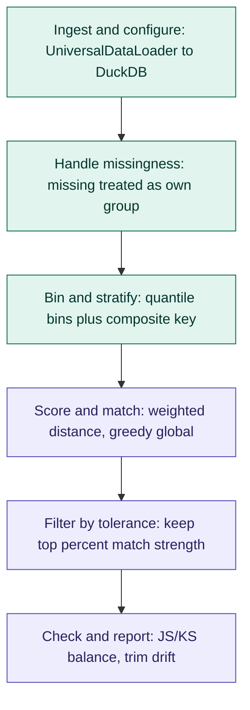
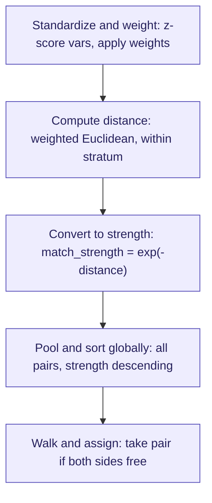

# Plan.md — RapidMatch (RiMatch) Control Group Matching

**Status:** Design locked (v1). Core library (Modules 1-13) implemented as the
`rapidmatch` Python package. DuckDB production path is live. Module 14 (FastAPI)
is not started. `UniversalDataLoader` is vendored from RapidSegment into
`rapidmatch/ingestion/data_loader.py`. Running-code map: `codegraph.md`.
See §8 Changelog for details.
**Purpose:** This file is the source of truth for the project. It is updated every time a
decision changes, a module is completed, or a new requirement is added. Any LLM or
collaborator picking up this project should be able to read this file alone and know
exactly what's decided, what's built, and what's left.

**Package:** RapidMatch (short form **RiMatch**, pronounced "rematch"). Import name:
`rapidmatch`. Public entry: `ControlMatcher(MatchConfig(...)).fit_match(data)`.

---

## 1. Objective

Build a simple, explainable (no ML/black-box) Python tool that takes a dataset with a
mix of numeric and categorical columns plus a binary treatment flag
(`1` = campaign target, `0` = not targeted), and constructs a **control group from the
`0` rows whose pre-campaign feature distribution closely mirrors the `1` group**.

This control group is used to measure the real impact of a campaign, isolated from
pre-existing differences in customer attributes between who was targeted and who
wasn't. All matching features must be **pre-campaign** — this is what makes the
comparison fair (no data leakage from the treatment itself).

## 2. Prior direction (superseded)

An earlier version of this project explored a generic, population-representative
sampling library (`repsample`) using a pluggable PySpark/PyArrow backend, targeting
"sample looks like the whole population" rather than "control looks like target."
That code was built but has been **discarded** — this document supersedes it. The
current design is purpose-built for treatment/control matching, uses PyArrow + DuckDB
only (no PySpark), and is simpler as a result.

## 3. Locked design decisions (v1)

| Decision | Choice |
|---|---|
| Package name | RapidMatch (RiMatch). Import: `rapidmatch`. Not `repmatch`. |
| Input formats | CSV, TSV, Parquet, Feather/Arrow, PyArrow Table, pandas DataFrame, Excel — ingested via RapidSegment's `UniversalDataLoader` (vendored copy at `rapidmatch/ingestion/data_loader.py`), not custom readers |
| Ingestion entry point | `stream_to_duckdb()` (default). Confirmed from source: for CSV/TSV/Parquet/Feather file paths it calls DuckDB's own `read_csv_auto`/`read_parquet`/`read_ipc` directly — the file never becomes a Python object at all. For PyArrow Table / pandas DataFrame / any DuckDB-registrable object passed as `data=`, it registers + `CREATE TABLE AS SELECT`, i.e. one materialization pass, since the object is already unavoidably in RAM by the time it reaches us. **Excel is the one path that can't be streamed directly** — the loader's own docstring requires calling `.load()` first (parses via openpyxl into a PyArrow Table in RAM), then passing that table to `stream_to_duckdb(data=...)`. After that call, we explicitly `del` our reference to the intermediate table so it's GC-eligible. `.load()` alone (pure in-memory PyArrow, no persistence) stays available as an explicit opt-in for small data / prototyping |
| Ingestion → our pipeline boundary | `stream_to_duckdb()` closes its own DuckDB connection and returns a plain file path (`str`), not a live connection or relation. **Our code owns the connection from that point on** — we call `duckdb.connect(path)` ourselves, and everything after that is where our lazy-evaluation principle applies. It always creates a fixed alias view named `udl_data` regardless of the table name used internally, so our code can just always read from `udl_data` rather than tracking a custom name. We pass `scorer_view_name=None` since that alias is for a different RapidSegment component we don't use |
| Numeric type convention | The loader casts all numeric columns to `DOUBLE`/`float64` automatically, both in `load()` and `stream_to_duckdb()`. Our binning/z-scoring code can rely on this — no mixed int/float handling needed |
| Internal representation | The disk-backed DuckDB table (`udl_data`) is the source of truth for anything at scale. A PyArrow Table only exists transiently: (a) if the user explicitly chose `.load()`, (b) for the unavoidable Excel intermediate step, or (c) for the final, stratum-scoped subset pulled back for Score & Match via `UniversalDataLoader.duckdb_to_arrow()` |
| Compute engine | DuckDB, operating directly on the disk-persisted table via a connection we open and own after ingestion hands off |
| Evaluation model | **Lazy by default**, starting from the moment we open our own connection to the ingested `.duckdb` file. Build up relations by chaining; execute only at a genuine terminal point. Laziness deliberately breaks at named checkpoints: data report `.summary()` (Module 2), bin edges (Module 5), stratum counts for coverage/`thin_stratum` checks (Module 6), and the final stratum-scoped subset handed to Python/NumPy before scoring (Module 7). Each checkpoint should be obvious in the code, not hidden inside a helper |
| pandas usage | Only as a one-time parser for Excel / pandas-in-memory inputs — never for computation |
| ML usage | None. Fully rule-based and explainable end to end |
| Binning | Quantile bins computed on the **target (1)** group, applied to control (0) |
| Stratification | Binned numeric vars + categorical vars (+ missingness flags) → composite stratum key |
| Missing values | Sentinel-imputed for distance math; a companion `is_missing_<var>` flag joins the stratum key so missing only matches missing. Categorical missing = its own literal category |
| Distance metric | Standardized, weighted Euclidean distance within a stratum. Standardization (z-score) is computed **globally** across the whole target group, not per stratum — keeps `match_strength` comparable across strata, which the global greedy matching and global tolerance filter both depend on |
| Variable weights | User-supplied `dict[var, weight]`; unspecified vars default to `1` |
| Match strength | `exp(-distance)`, bounded (0, 1] |
| Matching algorithm | Global greedy-edge matching: pool all valid pairs across strata, sort by strength descending, walk the list assigning if both sides are still free. **No Hungarian algorithm, no ML** |
| Matching ratio | 1:1 default, 1:n supported (n user-defined) |
| Replacement | Sampling without replacement always — a control row is used at most once, ever |
| Tolerance | Global percentile cutoff on match strength (not per-stratum). Default is strict — only top-tier matches kept |
| Uncovered target rows | Kept in output, not silently dropped, labeled via `match_status` |
| Min control pool per stratum | `min_control_pool_size` (default `5`, absolute floor) and optional `min_control_ratio` (control candidates required per target row in that stratum). Effective minimum = `max(min_control_pool_size, ceil(min_control_ratio × target_count_in_stratum))` when a ratio is given, else just the flat floor. Strata below this are labeled `thin_stratum` — separate from `no_control_available` (which means literally zero candidates). **Locked:** `thin_stratum` rows still proceed through matching and are flagged via a boolean that can co-occur with `matched` |
| Variable roles | `match_vars` (stratify + distance) vs. `monitor_vars` (post-hoc balance check only, not used to match) |
| Balance metrics | JS distance (categorical), KS statistic (numeric) — computed for both `match_vars` (sanity check) and `monitor_vars` (primary use) |
| Drift correction | If a `monitor_var` is flagged post-hoc, identify the specific over-represented rows/groups causing it and trim them from control |

## 3a. Code structure & modularity

**Rule: one file per independently meaningful, testable unit of logic — not
literally one file per function.** Taking "modular" to mean every single
function gets its own file is a known anti-pattern (file-explosion that hurts
navigability more than it helps). The rule adapts to what each module
actually *is*:

**Pipeline modules** (a sequence of distinct transformations) — one file per
step, with a class that imports and calls them in order. The class becomes a
readable table of contents for the whole module. Example — Module 5
(Binning & Stratification):
```
binning/
  stratifier.py          # class Stratifier -- orchestrates the four files below
  compute_bin_edges.py
  apply_bucket.py
  build_stratum_key.py
  get_stratum_counts.py
```

**Single cohesive object modules** (no natural sequence of steps) — stays as
one file for the object. Example — Module 3 (Configuration): a single
`config.py` holding the dataclass, plus a separate `validate.py` only if
validation logic is substantial enough to deserve its own tests. Forcing a
dataclass into several one-line files would hurt readability, not help it.

**Multi-artifact modules** (produce several independent outputs) — decompose
by *artifact*, not by function. Example — Module 13 (Reporting):
```
reporting/
  report.py                  # class Report -- assembles the three builders below
  build_coverage_summary.py
  build_balance_table.py
  build_drift_log.py
```

**Trivial private helpers** (prefixed `_`) used by exactly one function stay
colocated with their caller — they're promoted to their own file only once a
*second* caller genuinely needs them, not preemptively.

**Testing:** every step-file gets a matching test file
(`tests/binning/test_compute_bin_edges.py`), so there's a 1:1 mapping between
a unit of logic and a unit of test coverage.


Status legend: `[ ]` not started · `[~]` in progress · `[x]` done

### Module 1 — Ingestion & normalization
Code: `rapidmatch/ingestion/ingest.py`, `rapidmatch/ingestion/validate.py`. Loader vendored at `rapidmatch/ingestion/data_loader.py`.
- [x] Detect input kind and route accordingly:
      CSV/TSV/Parquet/Feather file path → `UniversalDataLoader(file_path=path).stream_to_duckdb(db_path=<work_dir>, scorer_view_name=None)`
      Excel file path → `table = UniversalDataLoader(file_path=path).load()`, then `UniversalDataLoader().stream_to_duckdb(data=table, db_path=<work_dir>, scorer_view_name=None)`, then `del table`
      In-memory PyArrow Table / pandas DataFrame → `UniversalDataLoader().stream_to_duckdb(data=obj, db_path=<work_dir>, scorer_view_name=None)`
- [x] Reopen our own connection to the returned `.duckdb` path (`duckdb.connect(path)`) — this is the handoff point from RapidSegment to our own lazy pipeline
- [x] Always read from the `udl_data` view (the fixed alias RapidSegment always creates) rather than tracking a custom table name
- [x] Basic schema validation against `udl_data` (target column exists, is binary, match/monitor vars exist) — via `information_schema`, no data scan needed
- [x] `work_dir` parameter (where the temp `.duckdb` file lives) — user-configurable, matters for I/O throughput at 7M-row scale
- [x] Lifecycle management: a session/context-manager object owns the `.duckdb` file path and guarantees cleanup on success *and* on error, so this never leaves orphaned files behind (`MatchSession`)

### Module 2 — Data report
Built from scratch — confirmed via source review that RapidSegment's loader contains
no profiling logic itself, so there's nothing to wrap here.
Code: `rapidmatch/data_report/report.py` (`DataReport`).
- [x] Single **batched** DuckDB query computing null counts for every column + target/control
      row counts together in one pass — not one query per column. At 7M rows, the
      difference is "profiling is instant" vs. "profiling silently costs a full scan per column"
- [x] Column type counts (categorical vs. numeric) via `information_schema.columns` —
      metadata only, no data scan needed
- [x] Target row count vs. non-target row count (the one thing specific to us that a
      generic loader has no concept of)
- [x] Lazy by default: building the report object triggers nothing; only calling
      `.summary()` / `.to_dict()` actually runs the query

### Module 3 — Configuration
Code: `rapidmatch/config.py` (`MatchConfig`).
- [x] Public API accepts: `match_vars`, `monitor_vars`, `weights` (dict, default 1), `priority_var` semantics folded into `weights`, `n` (matches per target row, default 1), `tolerance` (global percentile, strict default), `treatment_col`, `min_control_pool_size` (default `5`), `min_control_ratio` (optional, default `None`), plus `js_threshold` / `ks_threshold` for Module 11
- [x] Sensible validation + clear error messages for misconfiguration (e.g. overlapping match/monitor vars, unknown weight keys)

### Module 4 — Missing value handling
Code: `rapidmatch/missingness/handle_missing.py`.
- [x] Numeric: sentinel imputation + `is_missing_<var>` boolean flag added to stratum key
- [x] Categorical: missing mapped to explicit `"__MISSING__"` category
- [x] Confirm missing-flag columns are excluded from the distance calculation itself (they only affect stratification, not scoring)

### Module 5 — Binning & stratification (DuckDB)
Code: `rapidmatch/binning/` (`Stratifier` + step files). DuckDB SQL is the production path.
- [x] Compute quantile bin edges per numeric `match_var` from the **target group**, via DuckDB
- [x] Apply target-derived edges to the control pool
- [x] Build composite stratum key = binned numeric vars + categorical vars + missingness flags
- [x] `GROUP BY` in DuckDB to get target/control counts per stratum in one pass

### Module 6 — Coverage flagging
Code: `rapidmatch/coverage/flag_coverage.py`.
- [x] Identify target rows whose stratum has zero control rows
- [x] Keep them in the output, label `match_status = "no_control_available"`
- [x] Identify strata with fewer control candidates than the effective minimum (`min_control_pool_size` / `min_control_ratio`, see §3) and label their target rows `thin_stratum`
- [x] **Locked:** `thin_stratum` rows still proceed through matching and are flagged as lower-confidence (`thin_stratum` boolean, can co-occur with `matched`)

### Module 7 — Scoring
Code: `rapidmatch/scoring/scorer.py`. Production path is NumPy on the Arrow pull from `v_stratified`.
- [x] Compute mean/std per numeric `match_var` **globally** across the target group (not per stratum)
- [x] Apply global z-score standardization to numeric `match_vars` on both target and control rows
- [x] Apply user weight dict (default 1) per variable to the standardized (z-scored) values
- [x] Compute weighted Euclidean distance for every valid target–control pair within a stratum
- [x] Transform distance → `match_strength = exp(-distance)` — confirmed bounded in (0,1]

### Module 8 — Matching (global greedy, without replacement)
Code: `rapidmatch/matching/greedy_match.py`.
- [x] Pool all candidate pairs across every stratum into one list
- [x] Sort globally by `match_strength` descending
- [x] Walk the sorted list; assign a pair only if the target row has an open slot (of `n`) and the control row is unused; otherwise skip — no control row reused
- [x] Support `n` > 1 via per-target virtual slots — unit-tested at n=1 and n=2

### Module 9 — Tolerance filtering
Code: `rapidmatch/tolerance/apply_tolerance.py`.
- [x] Apply global percentile cutoff to accepted pairs (`cutoff = quantile(strengths, tolerance)`)
- [x] Pairs below cutoff: target row's status becomes `"below_tolerance"` unless another accepted match already covers it

### Module 10 — Output assembly
Code: `rapidmatch/output/assemble.py` (`MatchResult`).
- [x] Attach `match_strength`, `match_rank` (1 = best), `match_status` (`matched` / `no_control_available` / `below_tolerance` / `unmatched`) to every target row and its matched control row(s)
- [x] `thin_stratum` is informational and can co-occur with `matched` (separate boolean flag alongside `match_status`)

### Module 11 — Post-hoc balance validation
Code: `rapidmatch/balance/` (`checker.py`, `js_distance.py`, `ks_statistic.py`).
- [x] JS distance (categorical) / KS statistic (numeric) between matched control and target, for both `match_vars` (sanity check — should already be tight) and `monitor_vars` (primary check)
- [x] Flag columns exceeding threshold (JS > 0.10, KS > 0.05, configurable via `js_threshold` / `ks_threshold`)

### Module 12 — Drift diagnosis & correction
Code: `rapidmatch/drift/diagnose.py`, `rapidmatch/drift/correct.py`. Trim-only (no swap-in). Weakest `match_strength` rows dropped first.
- [x] For flagged `monitor_vars`, identify over-represented categories/bins in control vs. target
- [x] Pinpoint the specific control rows causing the excess
- [x] Remove just enough of them to bring the group back to the target's share
- [x] Report exactly what was removed and why (column, group, row count) for auditability

### Module 13 — Reporting
Code: `rapidmatch/reporting/` (`Report` + three builders). Attached as `MatchResult.report`.
- [x] Coverage summary (% matched / no control / below tolerance)
- [x] Tolerance cutoff value actually used
- [x] Before/after balance table for `match_vars` and `monitor_vars`
- [x] Drift-correction log (what got trimmed, from Module 12)

### Module 14 — API layer (FastAPI)
**Sequencing note:** this comes *after* the core library (Modules 1–13) is built and
working as a standalone Python package. The API is a thin serving layer on top, not
built in parallel.
- [ ] Wrap the core matching pipeline in a FastAPI app so it can be served from a
      Python server (e.g. `POST /match` accepting a dataset reference/config, returning
      the matched table + report)
- [ ] Define request/response schemas (pydantic models) mirroring the config in
      Module 3 (`match_vars`, `monitor_vars`, `weights`, `n`, `tolerance`,
      `min_control_pool_size`, `min_control_ratio`, etc.)
- [ ] Decide on data I/O for the API: upload file vs. path/URI reference vs. reading
      from a shared location — TBD when we get here
- [ ] Async/background job handling for large (7M-row) requests, since matching won't
      complete within a single synchronous request cycle
- [ ] Basic error handling + validation responses (e.g. missing treatment column,
      unknown variable names)

## 5. Pipeline diagram



Teal = data preparation. Purple = matching & validation.

## 6. Score & match detail



**Worked example of the walk-and-assign step** (global list, strongest first):

| rank | target | control | strength | outcome |
|---|---|---|---|---|
| 1 | T1 | C7 | 0.91 | assigned |
| 2 | T2 | C7 | 0.88 | skipped — C7 already used |
| 3 | T1 | C3 | 0.85 | assigned (T1's 2nd slot, if n=2) |
| 4 | T3 | C9 | 0.80 | assigned |

No optimization solver — just first-come-first-served down a sorted list. Fast,
deterministic, and easy to explain to a non-technical stakeholder.

## 7. Open items / future enhancements (not in v1)

- CLI entry point (`rapidmatch --input data.parquet --treatment_col is_target ...`)
- Optional per-stratum (instead of global) tolerance filtering
- Optional OptBinning-based binning as an alternative to quantile binning
- Benchmark script against synthetic 7M-row data to confirm real-world scaling
- Formal common-support / overlap diagnostic between target and control propensity-adjacent scores (currently only handled implicitly via stratum coverage)
- **Backfill instead of trim-only for Module 12 drift correction.** Idea raised and
  explored in discussion, deliberately **not** adopted into the locked Module 12
  design — kept here as a documented idea for later, not a pending task.
  Current Module 12 only ever *removes* excess rows from an over-represented
  monitor_var group; it never pulls in a replacement. The alternative: when
  trimming, look for an *unused* control candidate in the **same stratum**
  (same match_vars group — this constraint is non-negotiable, a replacement
  from a different stratum would defeat the point of stratifying in the first
  place) that has the needed monitor_var value, and swap it in instead of just
  removing.
  - Verified on the toy dataset: trim-only gave KS=0.67 on the tenure monitor
    variable; swapping in two same-stratum replacements (prioritizing the
    *weakest* existing matches for replacement, to minimize damage) improved
    it to KS=0.43 — but the two swapped-in replacements had match_strength of
    only 0.10 and 0.02 versus the 0.45 and 0.20 they replaced. Real, sizeable
    trade-off, not a free upgrade.
  - Why it's not adopted yet: it blurs the match_vars/monitor_vars distinction
    — a monitor_var stops being purely "watched" and becomes something the
    system will actively trade match quality to fix, just through a weaker,
    secondary mechanism than the primary distance score. That's a legitimate
    design choice but a different one than what's currently locked, and it
    needs its own explicit decision (and a way to report the strength cost
    to stakeholders, not just the balance improvement) before it belongs in
    the main pipeline.
  - If revisited: prioritize replacing the *weakest* current matches first
    (never touch a strong match to fix a secondary variable), always fall
    back to trim-only when no same-stratum replacement exists, and always
    report the average match_strength lost alongside the balance gained.

## 8. Changelog

- **v1 spec locked.** Full step-by-step plan above agreed and finalized. No code
  written yet for this version. Diagrams added. This document created as source of
  truth.
- **Added `min_control_pool_size` / `min_control_ratio` and `thin_stratum` status.**
  Guards against strata that are technically "matched" but backed by too few control
  candidates to be a trustworthy comparison. Open question on whether `thin_stratum`
  rows still proceed through matching or get excluded — see Module 6.
- **Locked global (not per-stratum) z-scoring.** Standardization is computed once
  across the whole target group. Chosen for statistical stability (small strata would
  give noisy/unstable std) and, more importantly, because it's the only choice
  consistent with global greedy matching + global tolerance filtering — per-stratum
  scoring would make match_strength values incomparable across strata.
- **Backfill-instead-of-trim idea documented, not adopted.** Explored replacing
  Module 12's trim-only drift correction with a same-stratum swap-in approach.
  Verified it improves balance (KS 0.67 → 0.43 on a toy monitor variable) at a real
  cost to match quality (swapped-in candidates had strength ~0.02–0.10 vs the
  ~0.20–0.45 they'd replace). Kept in §7 as a future idea, not part of the locked
  Module 12 design — see §7 for full reasoning and conditions for revisiting.
- **Added Module 14 — FastAPI serving layer.** Planned as a thin wrapper on top of the
  core library, built only after Modules 1–13 are complete and working standalone.
  Not started; several implementation details (I/O method, async handling for
  large requests) intentionally left TBD until we get there.
- **Ingestion redesigned around RapidSegment's `UniversalDataLoader`, source-verified.**
  Fetched and read the actual `data_loader.py` rather than relying on PyPI copy.
  Confirmed: `stream_to_duckdb()` uses DuckDB's native `read_csv_auto`/`read_parquet`/
  `read_ipc` directly for CSV/TSV/Parquet/Feather (file never becomes a Python object);
  Excel requires `.load()` first (unavoidable RAM hit, openpyxl-based) then
  `stream_to_duckdb(data=...)`; numeric columns are auto-cast to `DOUBLE`; the function
  closes its own connection and returns a plain path string, which is the exact
  boundary where our own lazy-evaluation pipeline begins; a fixed `udl_data` view is
  always created regardless of internal table name. Resolved the open question on
  whether RapidSegment's profiling could be reused: it can't — `data_loader.py`
  contains no profiling logic, so the new Data Report module (Module 2) is built from
  scratch, scoped to null rates + dtype counts + target/control counts as one batched
  query.
- **Renumbered all modules (1→14) to insert the new Data Report module as Module 2.**
  Everything that was previously Module 2 (Configuration) through Module 13 (FastAPI)
  shifts up by one, to Module 3 through Module 14. All cross-references throughout
  this document updated to match; historical changelog entries above this one
  describe decisions using their *current* module numbers, not the numbers that were
  live at the time they were written.
- **Locked code structure convention (§3a): one file per independently meaningful,
  testable unit of logic, not one file per function.** Pipeline modules decompose by
  step (e.g. Binning); single cohesive objects stay as one file (e.g. Configuration);
  multi-artifact modules decompose by artifact (e.g. Reporting). Trivial private
  helpers stay colocated with their one caller until a second caller needs them.
- **Thin slice built and validated** (`reference_matcher.py` + `demo.py`). Core
  algorithm for Modules 5/7/8 (bin on target → stratify → global z-score →
  weighted distance → global greedy match without replacement) implemented in
  pure Python/NumPy and run against synthetic data with a known, deliberate
  imbalance. Results: 94.4% target coverage; matched control landed within
  1-2% of target's actual mean income/age, KS/JS divergence ~0.02-0.03 vs.
  ~0.33-0.42 for a naive random control sample (roughly 10-15x tighter).
  All sanity checks passed (no control row reused, match_strength bounded in
  (0,1], every target row accounted for, bin edges derived from target only).
  **Caveat:** this validates the algorithm, not the DuckDB integration —
  DuckDB isn't installed in the build sandbox, so the production
   `matcher_duckdb.py` (same algorithm, DuckDB SQL for the columnar/group-by
   work) is written carefully but not yet executed; needs to be run and
   confirmed on the user's machine.
- **Library named RapidSampler (RaSe)** (superseded — see rename below). Import
  was `rapidsampler`. `UniversalDataLoader` vendored in-tree. Public API is
  `ControlMatcher(MatchConfig).fit_match(...)`.
- **Modules 1-13 implemented in DuckDB/NumPy production code.** Thin-slice
  Python reference superseded. `thin_stratum` locked as match-and-flag.
  Module 2 DataReport is lazy. Module 11 JS/KS with configurable thresholds.
  Module 12 trim-only, weakest matches first. Module 13 `MatchResult.report`.
  Tests: `python3 -m pytest tests -q`. Demo: `demo.py`, `demo.ipynb`.
  LLM map: `codegraph.md`. Module 14 FastAPI still not started.
- **Renamed RapidSampler (RaSe) → RapidMatch (RiMatch).** Pronounced "rematch".
  Import package `rapidmatch`. Package directory, `pyproject.toml`, imports,
  `plan.md`, `codegraph.md`, `demo.py`, and `demo.ipynb` all updated.
